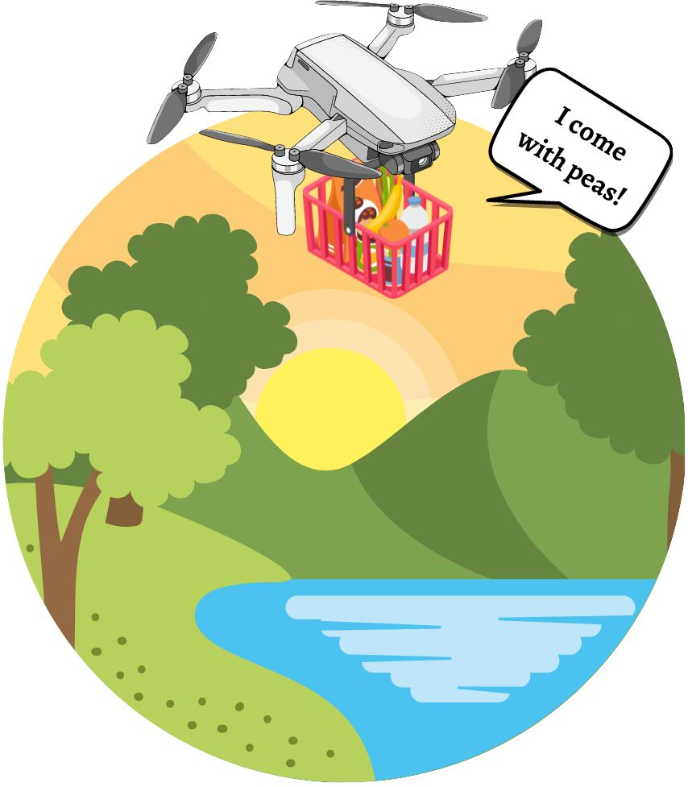

# Skynet Eats — Accessible Development


A drone food delivery landing page — the **Accessible Development project** from **Scrimba's Fullstack Web Development Path**.

This README is written as a **complete concept revision guide**. Reading it top to bottom will revise every accessibility concept introduced in this module, comparing what is new here against the HTML/CSS and JavaScript fundamentals covered in earlier folders.

---

# Table of Contents

1. [Project Overview](#1-project-overview)
2. [Project Structure](#2-project-structure)
3. [What is Web Accessibility?](#3-what-is-web-accessibility)
4. [What's New vs Previous Projects](#4-whats-new-vs-previous-projects)
5. [Semantic HTML](#5-semantic-html)
   - [nav](#51-nav)
   - [main](#52-main)
   - [section](#53-section)
   - [footer](#54-footer)
   - [form and label](#55-form-and-label)
6. [Color Contrast](#6-color-contrast)
7. [Alternative Text (Deep Dive)](#7-alternative-text-deep-dive)
8. [Accessible Links](#8-accessible-links)
9. [Labels and Form Accessibility](#9-labels-and-form-accessibility)
10. [ARIA — Accessible Rich Internet Applications](#10-aria--accessible-rich-internet-applications)
11. [Skip Navigation Link](#11-skip-navigation-link)
12. [Text Size and Readability](#12-text-size-and-readability)
13. [Accessible JavaScript](#13-accessible-javascript)
14. [Hiding Content Accessibly](#14-hiding-content-accessibly)
15. [External Libraries Used](#15-external-libraries-used)
16. [New CSS Concepts Introduced](#16-new-css-concepts-introduced)
17. [How to Run](#17-how-to-run)
18. [Course Reference](#18-course-reference)

---

# 1. Project Overview

Skynet Eats is a fictional drone-based food delivery service landing page. The page includes:

* A **navigation bar** with a skip-to-main link, logo, and nav links
* A **hero section** with a headline, tagline, and call-to-action button
* An **info section** with statistics about drones, customers, and cat conflicts
* An **about section** with a background image and company blurb
* A **sign-up form** with labeled inputs and a submit button
* A **footer** with social media links using icon libraries

The goal of this module is not just to build a page — it is to build one that **works for everyone**, including users who rely on screen readers, keyboard navigation, or high-contrast displays.

---

# 2. Project Structure

```
03. Accessible Development/
│
└── Synet Eats/
    ├── index.html      → Semantic HTML structure with accessibility features
    ├── index.css       → Styling + skip link visibility pattern
    ├── index.js        → Minimal JavaScript — form field reset on submit
    └── images/
        ├── hero-image.jpg    → Hero section drone illustration
        ├── pal9000.jpg       → Info section drone image
        └── clouds.jpg        → About section background
```

---

# 3. What is Web Accessibility?

**Web accessibility** means building websites that can be used by **everyone** — including people with:

| Disability Type | How They Use the Web |
|-----------------|----------------------|
| Visual impairment (blind/low vision) | Screen readers (e.g. NVDA, VoiceOver) read the page aloud |
| Motor impairment | Keyboard-only navigation — no mouse |
| Colour blindness | Cannot distinguish certain colour combinations |
| Cognitive disability | Benefit from clear structure, simple language, consistent patterns |
| Deafness | Rely on captions/transcripts for audio/video content |

### The WCAG Standard

**WCAG** (Web Content Accessibility Guidelines) is the international standard for accessibility, maintained by the W3C. The main principles are summarised as **POUR**:

| Principle | Meaning |
|-----------|---------|
| **P**erceivable | Users can perceive all content (text, images, audio) |
| **O**perable | Users can operate all controls via keyboard, not just mouse |
| **U**nderstandable | Content and UI behaviour are clear and predictable |
| **R**obust | Works with current and future assistive technologies |

> WCAG 2.1 Level AA is the most commonly targeted compliance level in the industry.

---

# 4. What's New vs Previous Projects

This project introduces a set of **completely new HTML tags, attributes, and CSS patterns** not used in the HTML/CSS Fundamentals or JavaScript Fundamentals folders.

## New HTML Tags

| Tag | First Used In | Purpose |
|-----|---------------|---------|
| `<nav>` | This project | Landmark: marks the navigation region |
| `<main>` | This project | Landmark: marks the primary content region |
| `<section>` | This project | Groups thematically related content |
| `<footer>` | This project | Landmark: marks the footer region |
| `<form>` | This project | Groups form controls |
| `<label>` | This project | Associates text label with an input |

## New HTML Attributes

| Attribute | Tag it Appears On | Purpose |
|-----------|-------------------|---------|
| `id="main-content"` | `<main>` | Target anchor for skip navigation link |
| `for="name"` | `<label>` | Links label to its `<input>` by matching the input's `id` |
| `type="email"` | `<input>` | Email-specific keyboard + built-in validation |
| `type="button"` | `<button>` | Prevents default form submission |
| `crossorigin` | `<link>` | Needed for cross-origin font preconnect requests |
| `rel="preconnect"` | `<link>` | Performance: establishes early connection to Google Fonts |
| `nomodule` | `<script>` | Fallback for browsers that don't support ES modules |
| `type="module"` | `<script>` | Loads script as an ES module (used by Ionicons) |
| `data-icon` | `<span>` | Iconify-specific attribute that specifies which icon to render |

## New CSS Patterns

| Pattern | Purpose |
|---------|---------|
| `.skip-link` with `left: -9999px` | Visually hide skip link until focused |
| `.skip-link:focus` with `left: 50%` | Show skip link only when keyboard-focused |
| `background-blend-mode` | Blends background image with background colour |
| `transition` | Smooth animation for skip link reveal |
| `position: absolute` on skip link | Takes it out of document flow so it doesn't affect layout |
| `z-index: 1000` | Ensures skip link appears above all other elements |

---

# 5. Semantic HTML

**Semantic HTML** means using HTML tags that describe the *meaning* of the content they contain — not just how it looks.

### Non-semantic approach (old way)

```html
<div class="navbar"> ... </div>
<div class="main-content"> ... </div>
<div class="footer"> ... </div>
```

### Semantic approach (correct)

```html
<nav> ... </nav>
<main> ... </main>
<footer> ... </footer>
```

Both render identically in the browser. But semantic tags do something divs cannot:

1. **Screen readers** announce the element type to users: *"Navigation landmark"*, *"Main region"*, *"Footer"*
2. **Search engines** understand page structure, improving SEO
3. **Developer tools** can outline the document structure correctly

---

## 5.1 `<nav>`

The `<nav>` tag marks a block of **navigation links** — links that help users move around the site.

```html
<nav class="navbar">
    <a class="skip-link" href="#main-content">Skip to main content</a>
    <div class="logo">
        <span class="iconify icon" data-icon="healthicons:drone-outline"></span>
        <p class="logo-text">Skynet Eats</p>
    </div>
    <ul class="nav-links">
        <li><a class="nav-link" href="index.html">Home</a></li>
        <li><a class="nav-link" href="#">About</a></li>
        <li><a class="nav-link" href="#">Contact</a></li>
        <li><a class="nav-link" href="#">Sign up</a></li>
    </ul>
</nav>
```

* Screen readers announce this region as "Navigation" — users can jump directly to it
* Not every group of links should be a `<nav>` — only primary navigation that helps users traverse the site
* Breadcrumbs and pagination can also be wrapped in `<nav>`

> You can have more than one `<nav>` per page (e.g. primary nav + footer nav), but use them purposefully.

---

## 5.2 `<main>`

The `<main>` tag marks the **primary, unique content** of the page — everything except the header, nav, and footer.

```html
<main id="main-content">
    <!-- hero section -->
    <!-- info section -->
    <!-- about section -->
    <!-- form section -->
</main>
```

* There should be **only one `<main>` per page**
* The `id="main-content"` is the **anchor target** for the skip navigation link (covered in Section 11)
* Screen readers can jump directly to the main content, skipping the navbar entirely

---

## 5.3 `<section>`

The `<section>` tag groups **thematically related content** within the page.

```html
<section class="hero-section"> ... </section>
<section class="info-section"> ... </section>
<section class="about-section"> ... </section>
<section class="form-section"> ... </section>
```

* Each section in this project has its own heading (`<h2>`) — this is important for screen reader navigation
* `<section>` is different from `<div>`: `<div>` is a generic container with no meaning; `<section>` signals that the content forms a self-contained thematic unit
* Do NOT use `<section>` just for styling. If the content doesn't have its own logical theme and heading, use a `<div>`

### When to use `<section>` vs `<div>`

| Use `<section>` when... | Use `<div>` when... |
|-------------------------|---------------------|
| Content has a heading and a distinct topic | Just grouping for styling purposes |
| The content would make sense in an outline | The group has no semantic meaning |
| A screen reader user would want to navigate to it | It's a layout wrapper only |

---

## 5.4 `<footer>`

The `<footer>` tag marks the **footer region** of the page — typically contains copyright info, social links, and secondary navigation.

```html
<footer class="footer">
    <ul class="social-links">
        <li><a class="social-link" href="#">
            <ion-icon class="icon" name="logo-facebook"></ion-icon>
            <p>Facebook</p>
        </a></li>
        <!-- ... more social links ... -->
    </ul>
</footer>
```

* Screen readers announce this as the "Footer" landmark
* Wrapping social links in a `<ul>` is semantically correct — these are a *list* of links
* Unlike `<nav>`, `<footer>` does not need to be wrapped in `<nav>` even if it contains links

---

## 5.5 `<form>` and `<label>`

The `<form>` tag wraps all form controls. The `<label>` tag provides a visible, accessible text label for each input.

```html
<form>
    <h2 class="form-heading">What's Next?</h2>
    <p class="form-intro">Want pizza through your window?🍕</p>

    <label for="name">Full name</label>
    <input class="input" id="name" type="text" placeholder="Ariana Regular" />

    <label for="email">Email</label>
    <input class="input" id="email" type="email" placeholder="ariana.regular@gmail.com" />

    <button class="submit-button" type="button" onclick="submitForm()">Notify me</button>
</form>
```

### How `<label>` Works

The `for` attribute on `<label>` must exactly match the `id` attribute on its paired `<input>`:

```
<label for="email">   →   <input id="email">
         ↑                         ↑
     same value               same value
```

This creates a **programmatic association** between the label and the input. Benefits:

1. **Screen readers** read the label aloud when the input is focused: *"Email, edit text"*
2. **Clicking the label text** focuses the input — larger click target, better usability
3. **Placeholder text alone is NOT a substitute** — it disappears when the user starts typing

> Never use `placeholder` as the only label. Always use a visible `<label>`. The placeholder should give an example value, not describe what the field is.

---

# 6. Color Contrast

Color contrast is the difference in luminance between text color and background color. Low contrast makes text hard to read for everyone — especially people with low vision or color blindness.

### WCAG Contrast Ratios

| WCAG Level | Normal Text (< 18pt) | Large Text (≥ 18pt or bold ≥ 14pt) |
|------------|---------------------|------------------------------------|
| AA (minimum) | **4.5 : 1** | 3 : 1 |
| AAA (enhanced) | 7 : 1 | 4.5 : 1 |

### In This Project

```css
body {
    color: #333333;  /* dark grey text */
}
/* background is white (default) */
/* contrast ratio: ~12.6:1 — well above AA */
```

```css
.stat p {
    color: #ffffff;  /* white text */
    /* parent .statistics has background-color: #333333 */
    /* contrast ratio: ~12.6:1 — passes */
}
```

```css
.stat-heading {
    color: #cccccc;  /* light grey */
    /* on dark background #333333 */
    /* contrast ratio: ~5.9:1 — passes AA */
}
```

### How to Check Contrast

Use the **WebAIM Contrast Checker** at [webaim.org/resources/contrastchecker/](https://webaim.org/resources/contrastchecker/) — enter the foreground and background hex codes and it tells you the ratio and whether it passes WCAG.

> **Rule of thumb:** Never use light grey text on a white background, or dark grey text on a dark background. If you squint and struggle to read it — it fails.

---

# 7. Alternative Text (Deep Dive)

Alt text for images was introduced in the HTML/CSS fundamentals folder. This module adds nuance: **not all images are the same**, and each type needs different alt text treatment.

## 7.1 Informative Images

Images that convey content or information. Write descriptive alt text.

```html
<!-- Hero image: communicates mood and brand -->

```

The alt text here captures both the visual content AND the joke — which is part of the informational value of the image.

## 7.2 Informative Image in a Different Context

```html
<!-- Info section: shows what a Skynet drone looks like -->

```

Short and functional — the drone is what the image is about.

## 7.3 Decorative Images (Empty Alt)

If an image is purely decorative and adds no information, use `alt=""` (empty alt). Screen readers will skip it entirely.

```html
<!-- Example of a decorative image — screen readers skip it -->

```

> The `alt` attribute MUST still be present — just leave it empty. Without `alt`, screen readers read out the filename, which is noisy and confusing.

## 7.4 Background Images

The clouds image in the About section is applied as a **CSS background image** — not an `` tag:

```css
.about-section {
    background-image: url(images/clouds.jpg);
    background-blend-mode: lighten;
    background-size: cover;
}
```

CSS background images have **no alt text mechanism**. This is intentional — they should only be used for **decorative** images that don't convey information. Informative images must always be HTML `` tags.

---

# 8. Accessible Links

Links were introduced in the HTML/CSS fundamentals folder. This module adds accessibility rules for writing good link text.

## 8.1 Descriptive Link Text

Screen reader users often navigate a page by **listing all links** on the page. If all your links say "click here" or "read more", users have no idea where they go.

```html
<!-- ❌ Bad — out of context, this is meaningless -->
<a href="#">Click here</a>
<a href="#">Read more</a>

<!-- ✅ Good — descriptive, meaningful out of context -->
<a href="#">check out our partnered shops here</a>
<a href="#">About Skynet</a>
```

In the info section:

```html
<p>...if you don't want fast food, but you want your food fast,
   <a href="#">check out our partnered shops here</a>.
</p>
```

The link text "check out our partnered shops here" clearly describes the destination.

## 8.2 Color is Not the Only Cue

In this project, links in the info section are distinguished by both color AND underline:

```css
.info a {
    color: #007000;
    text-decoration: underline;
}
```

**Why?** Users with color blindness cannot distinguish a link by color alone. Adding an underline means the link is identifiable even if the color cannot be perceived.

> WCAG requires that links are distinguishable from surrounding text by something other than color alone.

---

# 9. Labels and Form Accessibility

Forms are one of the most accessibility-critical parts of any website. This project demonstrates the correct pattern.

## 9.1 `for` / `id` Pairing — Full Example

```html
<!-- The label's 'for' value MUST match the input's 'id' value -->
<label for="name">Full name</label>
<input class="input" id="name" type="text" placeholder="Ariana Regular" />

<label for="email">Email</label>
<input class="input" id="email" type="email" placeholder="ariana.regular@gmail.com" />
```

### What Happens Without a Label

Without a `<label>`, a screen reader user who tabs to the input hears only: *"edit text"* — they have no idea what to type. With the label, they hear: *"Full name, edit text"*.

## 9.2 Input Types

```html
<!-- type="text" → standard keyboard -->
<input type="text" />

<!-- type="email" → email-specific keyboard on mobile + browser validates format -->
<input type="email" />
```

Using the correct `type` attribute:
1. Shows the appropriate keyboard on mobile devices (e.g., `@` key on the email keyboard)
2. Enables browser's built-in validation (e.g., rejects "notanemail" for `type="email"`)

## 9.3 Button Type

```html
<button class="submit-button" type="button" onclick="submitForm()">Notify me</button>
```

`type="button"` prevents the default form submission behavior (which would reload the page). This was not seen in previous projects because earlier projects used standalone buttons outside forms.

| `type` value | Behavior |
|--------------|---------|
| `type="submit"` | Submits the form (default if omitted inside `<form>`) |
| `type="button"` | Does nothing by default — requires JS to do something |
| `type="reset"` | Clears all form fields |

---

# 10. ARIA — Accessible Rich Internet Applications

**ARIA** is a set of HTML attributes that add extra semantic meaning for assistive technologies. They do NOT change how things look — they only affect what screen readers announce.

> **Rule 1 of ARIA: Don't use ARIA if native HTML already provides the semantics.**
> Using `<nav>`, `<main>`, `<section>`, `<label>` correctly is always better than adding ARIA attributes on divs.

## 10.1 ARIA Landmarks (via Semantic HTML)

The landmark roles in this project are all provided by semantic HTML elements:

| HTML Element | Implicit ARIA Role |
|--------------|-------------------|
| `<nav>` | `role="navigation"` |
| `<main>` | `role="main"` |
| `<footer>` | `role="contentinfo"` |
| `<form>` | `role="form"` (when it has an accessible name) |
| `<section>` | `role="region"` (when it has a heading) |

These roles are built into the browser — you get them for free just by using the correct semantic elements.

## 10.2 ARIA Live Regions

ARIA live regions tell screen readers to **announce dynamic content changes** automatically, without the user having to navigate back to that part of the page.

This is critical for JavaScript-driven updates — for example, if the form showed a success message after submission.

```html
<!-- Screen reader will announce changes to this element automatically -->
<p aria-live="polite" id="form-status"></p>
```

```javascript
// When JS updates this element, the screen reader reads it aloud
document.getElementById("form-status").textContent = "You've been added to the list!"
```

### `aria-live` Values

| Value | Behaviour |
|-------|-----------|
| `"polite"` | Waits for the user to finish their current action before announcing |
| `"assertive"` | Interrupts immediately — use only for urgent alerts (errors) |
| `"off"` | Default — changes are not announced |

> In this project, the form clears on submit but doesn't show a success message. A production-ready version should use `aria-live="polite"` to announce confirmation.

## 10.3 `aria-label` and `aria-labelledby`

Used when you need to give an element an accessible name that isn't visible on screen.

```html
<!-- Example: icon-only button needs an aria-label -->
<button aria-label="Close dialog">✕</button>
```

```html
<!-- aria-labelledby points to another element's id -->
<section aria-labelledby="about-heading">
    <h2 id="about-heading">About Us</h2>
    ...
</section>
```

---

# 11. Skip Navigation Link

The skip navigation link is the most important accessibility pattern for keyboard users.

### The Problem

Keyboard users navigate with the `Tab` key — they must Tab through every link in the navigation bar before reaching the main content. On a page with 10 nav links, that means pressing Tab 10 times just to get to the article they want to read.

### The Solution — Skip Link

A "Skip to main content" link is placed as the **very first element** inside `<body>`. It is visually hidden by default, but becomes visible when focused (i.e., when a keyboard user Tabs to it).

```html
<nav class="navbar">
    <!-- First element in nav — first thing a keyboard user reaches -->
    <a class="skip-link" href="#main-content">Skip to main content</a>
    ...
</nav>

<!-- The target -->
<main id="main-content">
    ...
</main>
```

### The CSS Pattern

```css
/* Hidden off-screen by default */
.skip-link {
    position: absolute;
    left: -9999px;        /* moved far off-screen — invisible */
    top: auto;
    width: 1px;
    height: 1px;
    overflow: hidden;
    transition: left 3s;
}

/* Becomes visible and centered when keyboard-focused */
.skip-link:focus {
    left: 50%;                    /* snap to center */
    top: 10px;
    width: auto;
    height: auto;
    padding: 10px 20px;
    background-color: #333333;
    color: #ffffff;
    transform: translateX(-50%);  /* truly center it */
    z-index: 1000;                /* appear above everything */
    transition: left 1s;          /* smooth slide in */
}
```

### How It Works

1. Mouse users never see it (it's off-screen)
2. A keyboard user presses Tab → the skip link receives focus → it slides into view
3. The user presses Enter → the browser jumps to `<main id="main-content">`
4. The user continues navigating from within the main content

### New CSS Properties Used Here

| Property | What It Does |
|----------|-------------|
| `position: absolute` | Takes element out of the normal document flow — does not affect layout of surrounding elements |
| `left: -9999px` | Moves element far to the left — off-screen, effectively invisible without using `display: none` (which would also hide it from screen readers) |
| `overflow: hidden` | Hides any content that might overflow the 1×1 pixel box |
| `transition: left 1s` | Animates the `left` property change over 1 second — creates the slide-in effect |
| `transform: translateX(-50%)` | When `left: 50%` is set, the element's left edge is at the center. `translateX(-50%)` shifts it left by half its own width, perfectly centering it |
| `z-index: 1000` | Stacks the element above all other content (higher number = closer to viewer) |
| `:focus` pseudo-class | Targets the element only when it is keyboard-focused (or clicked) |

---

# 12. Text Size and Readability

## 12.1 `font-size` in `rem`

Previous projects used `px` for font sizes. This project uses `rem` for some sizes in the CSS:

```css
.nav-link {
    font-size: 1rem;
}
.icon {
    font-size: 2rem;
}
```

| Unit | What it's relative to | Accessibility impact |
|------|-----------------------|---------------------|
| `px` | Absolute — ignores user browser settings | If user sets their browser font to "large", `px` overrides them |
| `rem` | Relative to the root (`<html>`) font size (default: 16px) | Respects user's browser font size preference |
| `em` | Relative to the parent element's font size | Can compound unpredictably in nested elements |

> `1rem = 16px` by default. `1.25rem = 20px`, `2rem = 32px`.

**Accessibility principle:** Use `rem` for font sizes so visually impaired users who increase their browser's default font size see text scale correctly.

## 12.2 `line-height`

```css
body {
    line-height: 1.5;
}
```

`line-height: 1.5` sets the line spacing to 1.5× the font size. This improves readability, especially for users with dyslexia. WCAG recommends a minimum of 1.5 for body text.

---

# 13. Accessible JavaScript

The JavaScript in this project is minimal — it clears the form inputs on submit.

```javascript
document.querySelector(".submit-button").onclick = function() { submitForm() };

const submitForm = () => {
    document.getElementById("name").value = ""
    document.getElementById("email").value = ""
}
```

### Key Principles for Accessible JavaScript

1. **Don't remove focus styles** — Never write `*:focus { outline: none; }`. Focus outlines are how keyboard users know where they are.

2. **Keep interactive elements native** — Use `<button>` for buttons, `<a>` for links. Don't make `<div>` clickable with JS unless there is no alternative. Native elements are keyboard-accessible and recognized by screen readers by default.

3. **Don't trigger behavior on mouse-only events** — `onmouseover` is not triggered by keyboard. Use `onclick` (which fires on both mouse click and keyboard Enter/Space) or `addEventListener("click", ...)`.

4. **Announce dynamic changes** — If JavaScript updates content on the page, use ARIA live regions so screen readers are notified.

5. **Don't auto-play or auto-redirect** — Don't redirect the user or start playing media without user action.

---

# 14. Hiding Content Accessibly

There are three ways to hide content, and they have very different effects on screen readers:

| Method | Visible on screen? | Read by screen reader? | Use case |
|--------|--------------------|------------------------|----------|
| `display: none` | ❌ No | ❌ No | Truly hide from everyone |
| `visibility: hidden` | ❌ No | ❌ No | Preserve layout space but hide content |
| `opacity: 0` | ❌ No | ✅ Yes | Animate fade-out — screen readers still read it |
| `position: absolute; left: -9999px` | ❌ No | ✅ Yes | Visually hide but keep accessible (skip link pattern) |

### The Skip Link Pattern Explained

The skip link uses `left: -9999px` (not `display: none`) specifically because:
- `display: none` would hide it from screen readers too
- We WANT screen readers to announce it: *"Skip to main content, link"*
- We just don't want it visually cluttering the design for mouse users

```css
/* ❌ This hides from screen readers too */
.skip-link {
    display: none;
}

/* ✅ This hides visually but keeps it accessible */
.skip-link {
    position: absolute;
    left: -9999px;
    width: 1px;
    height: 1px;
    overflow: hidden;
}
```

---

# 15. External Libraries Used

This project introduces using **external JavaScript libraries** via CDN — new compared to previous projects.

## 15.1 Normalize.css

```html
<link rel="stylesheet" href="https://cdnjs.cloudflare.com/ajax/libs/normalize/8.0.1/normalize.css">
```

Different browsers apply different default styles to HTML elements. Normalize.css resets these differences so the page looks consistent across all browsers.

> Without normalize.css, a button might look slightly different in Chrome vs Firefox vs Safari.

## 15.2 Iconify

```html
<script src="https://code.iconify.design/2/2.2.1/iconify.min.js"></script>
```

Iconify is an icon library. Icons are rendered using a `<span>` with a `data-icon` attribute:

```html
<span class="iconify icon" data-icon="healthicons:drone-outline"></span>
```

* `data-icon` — a custom HTML attribute (starts with `data-`) that Iconify reads to know which icon to draw
* `data-*` attributes are a standard HTML5 mechanism for storing custom data on elements

## 15.3 Ionicons (ES Module)

```html
<!-- ES Module version (modern browsers) -->
<script type="module" src="https://unpkg.com/ionicons@5.5.2/dist/ionicons/ionicons.esm.js"></script>

<!-- Fallback for older browsers that don't support modules -->
<script nomodule src="https://unpkg.com/ionicons@5.5.2/dist/ionicons/ionicons.js"></script>
```

Ionicons renders as custom HTML elements:

```html
<ion-icon class="icon" name="logo-facebook"></ion-icon>
```

### `type="module"` vs `nomodule`

| Attribute | Who uses it |
|-----------|-------------|
| `type="module"` | Modern browsers — loads the smaller, efficient ES module version |
| `nomodule` | Old browsers — loads the full script as a fallback. Modern browsers skip `nomodule` scripts |

## 15.4 Google Fonts — Preconnect

```html
<link rel="preconnect" href="https://fonts.googleapis.com">
<link rel="preconnect" href="https://fonts.gstatic.com" crossorigin>
<link href="https://fonts.googleapis.com/css2?family=Poppins:wght@100;200;300;400;500;600;700;800;900&display=swap" rel="stylesheet">
```

### `rel="preconnect"`

Tells the browser to establish a connection to the Google Fonts servers **early** — before the actual font request is made. This reduces the time the browser spends waiting for the font file.

### `crossorigin`

The `fonts.gstatic.com` domain serves the actual font files. The `crossorigin` attribute is needed because fonts are loaded cross-origin and browsers require this attribute for the preconnect to apply correctly to cross-origin resources.

---

# 16. New CSS Concepts Introduced

## 16.1 `box-sizing: border-box`

```css
* {
    box-sizing: border-box;
}
```

By default (`content-box`), when you set `width: 300px` on an element and then add `padding: 20px`, the actual rendered width becomes `300px + 20px + 20px = 340px`.

With `border-box`, the total rendered width **includes** padding and border — so `width: 300px` with `padding: 20px` gives you a 300px wide element with the content area shrinking to fit.

> `* { box-sizing: border-box; }` is the first line of CSS on almost every professional project. It makes sizing elements predictable.

## 16.2 `position: relative` and `position: absolute`

```css
.hero-section {
    position: relative;    /* establishes a positioning context */
}
.hero-image {
    position: absolute;    /* positioned relative to .hero-section */
    right: -20px;
    top: -50px;
    z-index: -1;           /* sits behind other content */
}
```

| Value | Behavior |
|-------|---------|
| `position: static` | Default — in normal document flow |
| `position: relative` | In normal flow, but can be nudged with top/left/right/bottom. Also creates a **positioning context** for child `absolute` elements |
| `position: absolute` | Removed from normal flow. Positioned relative to the nearest `position: relative` ancestor (or the viewport if none exists) |
| `position: fixed` | Removed from normal flow. Positioned relative to the viewport — stays put when scrolling |

## 16.3 `background-blend-mode`

```css
.about-section {
    background-color: rgba(255, 255, 255, 0.85);
    background-blend-mode: lighten;
    background-image: url(images/clouds.jpg);
}
```

`background-blend-mode` controls how the `background-image` blends with the `background-color`. The `lighten` value takes the lighter value of each pixel from the two layers.

This creates a washed-out, soft effect on the clouds image — making the text over it more readable.

## 16.4 `min-width`

```css
body {
    min-width: 900px;
}
```

Sets a minimum width for the body. If the viewport is smaller, a horizontal scrollbar appears. This project is not responsive (mobile-friendly) — `min-width` prevents the layout from breaking at smaller sizes.

## 16.5 `transition`

```css
.skip-link {
    transition: left 3s;
}
.skip-link:focus {
    transition: left 1s;
}
```

`transition` animates a CSS property change over time:

```
transition: property   duration   timing-function   delay;
transition: left       1s         ease               0s;
```

* `left 3s` on the default state means: *"when leaving the focused state, take 3 seconds to animate back off-screen"* (slow fade-out)
* `left 1s` on the `:focus` state means: *"when entering the focused state, take 1 second to slide in"* (fast slide-in)

---

# 17. How to Run

1. Clone the repository
   ```bash
   git clone https://github.com/Nilanchal0107/Web-Development-MiniProjects.git
   ```

2. Navigate to the project folder
   ```bash
   cd "03. Accessible Development/Synet Eats"
   ```

3. Open `index.html` in your browser or use **Live Server** in VS Code.

4. **Test accessibility:**
   - Press `Tab` on page load — the skip link should appear
   - Press `Enter` on the skip link — focus should jump to main content
   - Navigate the entire page using only `Tab` and `Enter` — nothing should get stuck
   - Use a screen reader (NVDA on Windows, VoiceOver on Mac) to hear how the page is announced

---

# 18. Course Reference

* **Platform:** [Scrimba Fullstack Path](https://scrimba.com/fullstack-path-c0fullstack)
* **Section:** Accessible Development Module
* **Topics Covered:** Text contrast · Alternative text · Links · Labels · Radio buttons · Semantic HTML · Lists · Text size · Headings · ARIA · ARIA live regions · Accessible JavaScript · Hiding content · Skip Navigation Link
* **Reference Docs:**
  - [MDN — ARIA](https://developer.mozilla.org/en-US/docs/Web/Accessibility/ARIA)
  - [WebAIM Contrast Checker](https://webaim.org/resources/contrastchecker/)
  - [WCAG 2.1 Guidelines](https://www.w3.org/TR/WCAG21/)
  - [MDN — `<label>`](https://developer.mozilla.org/en-US/docs/Web/HTML/Element/label)

---

# Author

**Nilanchal Jena**
GitHub: [https://github.com/Nilanchal0107](https://github.com/Nilanchal0107)

> *Accessibility is not a feature — it is a quality. A site is not "done" if it only works for some people. This module is the foundation for writing web experiences that are inclusive by default.*
