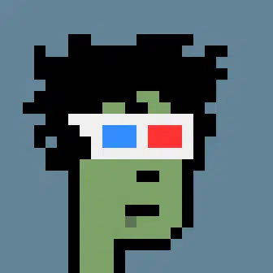
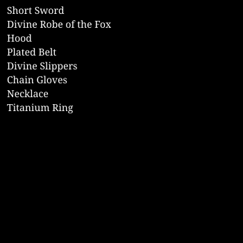

# FoolsGold — Essential CSS NFT Site


A satirical NFT marketplace landing page — the **Essential CSS project** from **Scrimba's Fullstack Web Development Path**.

This README is written as a **complete concept revision guide**. Reading it top to bottom will revise every core CSS concept introduced in this module, comparing what is new here against the HTML/CSS Fundamentals covered in earlier folders.

---

# Table of Contents

1. [Project Overview](#1-project-overview)
2. [Project Structure](#2-project-structure)
3. [What is "Essential CSS"?](#3-what-is-essential-css)
4. [What's New vs Previous Projects](#4-whats-new-vs-previous-projects)
5. [Typography](#5-typography)
   - [font-family and Google Fonts](#51-font-family-and-google-fonts)
   - [font-size](#52-font-size)
   - [font-weight](#53-font-weight)
   - [line-height](#54-line-height)
   - [color (text)](#55-color-text)
6. [The Box Model](#6-the-box-model)
   - [margin](#61-margin)
   - [padding](#62-padding)
   - [border-radius](#63-border-radius)
7. [Selectors Deep Dive](#7-selectors-deep-dive)
   - [Element Selectors](#71-element-selectors)
   - [Class Selectors](#72-class-selectors)
   - [Grouping Selectors](#73-grouping-selectors)
   - [Compound Selectors](#74-compound-selectors)
   - [Hover and Active Pseudo-classes](#75-hover-and-active-pseudo-classes)
8. [CSS Specificity](#8-css-specificity)
9. [The `display` Property](#9-the-display-property)
   - [inline vs block vs inline-block](#91-inline-vs-block-vs-inline-block)
   - [Flexbox](#92-flexbox)
10. [Buttons and Links Styled as Buttons](#10-buttons-and-links-styled-as-buttons)
11. [CSS Organisation and the Container Pattern](#11-css-organisation-and-the-container-pattern)
12. [Background Colour and Colour Inheritance](#12-background-colour-and-colour-inheritance)
13. [Image Sizing](#13-image-sizing)
14. [The CSS `overflow` Property](#14-the-css-overflow-property)
15. [The CSS `!important` Keyword](#15-the-css-important-keyword)
16. [The `a` Element — Link Styling Deep Dive](#16-the-a-element--link-styling-deep-dive)
17. [The Footer](#17-the-footer)
18. [HTML Structure Recap](#18-html-structure-recap)
19. [How to Run](#19-how-to-run)
20. [Course Reference](#20-course-reference)

---

# 1. Project Overview

FoolsGold is a fictional (and intentionally satirical) NFT marketplace. The page includes:

* A **header** with the site title and a tongue-in-cheek subtitle
* A **first section** featuring a $33,000 NFT sneaker with a hero image, description paragraph, and two call-to-action buttons
* A **second section** (dark background) showcasing two "premium" NFTs side by side using Flexbox
* A **footer** with a copyright notice

The goal of this module is not just to build a page — it is to master the **essential CSS properties and patterns** that professional developers use on every project: the box model, selectors, specificity, display modes, flexbox, and the container/layout pattern.

---

# 2. Project Structure

```
04. Essential CSS/
│
└── 01. NFT Site/
    ├── index.html      → HTML structure with header, two sections, and footer
    ├── index.css       → All styling: typography, layout, buttons, colours
    └── images/
        ├── sneakers-purple.png   → Hero image in section one
        ├── crypto-punk.jpg       → Left feature image in section two
        └── bag.svg               → Right feature image in section two (SVG)
```

---

# 3. What is "Essential CSS"?

"Essential CSS" refers to the core subset of CSS properties that appear on virtually every professional project. This module distills CSS down to the patterns you will use daily:

| Category | Properties Covered |
|----------|--------------------|
| Typography | `font-family`, `font-size`, `font-weight`, `line-height`, `color` |
| Box Model | `margin`, `padding`, `border-radius` |
| Layout | `display`, `flexbox`, `width`, `margin: auto` (centering) |
| Selectors | element, class, grouping, compound, pseudo-class |
| Specificity | understanding the cascade and conflict resolution |
| Visual | `background-color`, `text-decoration`, `text-align` |
| Interaction | `:hover`, `:active` pseudo-classes |

The project is deliberately small — the entire CSS file is under 130 lines — so you can see how much you can achieve with a focused, well-organised stylesheet.

---

# 4. What's New vs Previous Projects

This project introduces CSS patterns and properties **not seen in the HTML/CSS Fundamentals or Accessible Development folders**.

## New CSS Properties

| Property | Where Used | Purpose |
|----------|------------|---------|
| `font-family` | `body` | Sets the typeface for the whole page |
| `font-weight` | `.btn-*` classes | Controls text boldness |
| `line-height` | `p` | Controls space between lines of text |
| `text-decoration` | `a`, `.btn-*` | Adds/removes underlines on links |
| `display: inline-block` | `.btn-*` | Allows padding on an anchor without breaking inline flow |
| `display: flex` | `.section-two-image-container` | Enables flexbox layout for side-by-side images |
| `justify-content` | `.section-two-image-container` | Distributes space between flex children |
| `border-radius` | `.btn-*`, `.feature-image` | Rounds corners |
| `padding` (shorthand) | `.btn-*`, `header/section/footer` | Sets inner spacing |
| `margin: 0 auto` | `.container` | Horizontally centres a block element |
| `width` (fixed) | `.container`, `.feature-image` | Controls element dimensions |

## New HTML Patterns

| Pattern | First Used Here | Purpose |
|---------|-----------------|---------|
| `<header>` | This project | Semantic header landmark |
| `<section>` with class | This project | Distinguishes multiple sections visually |
| `<strong>` | This project | Inline bold emphasis |
| Multiple `<a>` styled as buttons | This project | Demonstrates compound class pattern |
| `.container` div pattern | This project | Centres and constrains content width |

---

# 5. Typography

## 5.1 `font-family` and Google Fonts

```css
body {
    font-family: 'Roboto', sans-serif;
}
```

```html
<!-- In <head>: preconnect for performance + font import -->
<link rel="preconnect" href="https://fonts.googleapis.com">
<link rel="preconnect" href="https://fonts.gstatic.com" crossorigin>
<link href="https://fonts.googleapis.com/css2?family=Roboto:wght@400;500;700&display=swap" rel="stylesheet">
```

### How `font-family` Works

The `font-family` property sets the typeface. The value is a **font stack** — a comma-separated list of fonts tried in order:

```
font-family: 'Roboto', sans-serif;
              ↑              ↑
        First choice    Fallback if Roboto fails to load
                        (browser picks any available sans-serif)
```

Setting it on `body` means **every element inherits it** — you don't need to repeat it on headings, paragraphs, or buttons unless you want a different font there.

### Google Fonts — Three `<link>` Tags

| Tag | Purpose |
|-----|---------|
| `<link rel="preconnect" href="https://fonts.googleapis.com">` | Establishes DNS + TCP connection to Google's API server early |
| `<link rel="preconnect" href="https://fonts.gstatic.com" crossorigin>` | Pre-connects to the server that actually hosts the font files |
| `<link href="...css2?family=Roboto:wght@400;500;700">` | Downloads the font CSS at the specified weights |

`wght@400;500;700` — only downloading the weights you use keeps the page load fast. `400` = regular, `500` = medium, `700` = bold.

> `display=swap` tells the browser to show a fallback font immediately while Roboto loads, then swap. This prevents a flash of invisible text (FOIT).

---

## 5.2 `font-size`

```css
body  { font-size: 16px; }
h1    { font-size: 36px; }
h3    { font-size: 20px; }
```

`font-size` sets how large the text renders. Values used here are in `px` (pixels) — an absolute unit. The body is set to `16px`, which matches the browser default, ensuring consistency.

| Unit | Relative to | Use case |
|------|-------------|----------|
| `px` | Nothing — absolute | Fixed sizes; predictable but ignores user browser settings |
| `rem` | Root `<html>` font size (default 16px) | Scales with user preferences (better for accessibility) |
| `em` | Parent element's font size | Can compound unexpectedly in nested elements |

> In this project `px` is used throughout. The Accessible Development module introduced `rem` — which is better practice for body text for accessibility reasons.

---

## 5.3 `font-weight`

```css
.btn-dark, .btn-mid, .btn-light {
    font-weight: 500;
}
```

`font-weight` controls how thick/thin the characters are:

| Value | Name | Note |
|-------|------|------|
| `400` | Normal | Default for body text |
| `500` | Medium | Slightly bolder — used on buttons here |
| `700` | Bold | Standard bold |
| `800` / `900` | Extra Bold / Black | Heavy display weights |

The `font-weight` value must be **available in your font import**. This project imports `wght@400;500;700` — so `font-weight: 500` works. If you imported only `400`, setting `font-weight: 700` would have no effect (the browser would fall back to the nearest available weight).

---

## 5.4 `line-height`

```css
p {
    line-height: 23px;
}
```

`line-height` controls the **vertical space between lines** of text within an element.

```
line-height: 23px;   ← absolute: always 23px regardless of font-size
line-height: 1.5;    ← unitless (preferred): 1.5 × the element's font-size
```

> Best practice is to use a **unitless multiplier** like `1.5` rather than `px`. This scales correctly if you change the font size later. WCAG recommends `line-height` of at least 1.5 for body text for readability.

---

## 5.5 `color` (text)

```css
body { color: #2b283a; }     /* Dark navy-grey for body text */
h1   { color: whitesmoke; }  /* Off-white on the purple header */
h3   { color: #d0aaff; }     /* Soft lavender subtitle */
```

`color` sets the **foreground text colour**. It is one of the most inherited properties — set it on `body` and all text elements inherit it unless overridden.

### Colour Formats in This Project

| Format | Example | Notes |
|--------|---------|-------|
| Named colour | `whitesmoke` | CSS has 140 named colours |
| Hex | `#2b283a` | 6 hex digits: `#RRGGBB` |
| Shorthand hex | `#5f29a3` | Full 6-digit form used here |

> `whitesmoke` is a named colour equivalent to `#F5F5F5` — a very slightly off-white. It is used here instead of `#ffffff` pure white to be easier on the eyes against a purple background.

---

# 6. The Box Model

Every HTML element is a rectangular box made up of four layers (from inside out):

```
┌─────────────────────────────────────┐
│              MARGIN                 │  ← Space outside the element
│  ┌───────────────────────────────┐  │
│  │           BORDER              │  │  ← Visible edge (not used here)
│  │  ┌─────────────────────────┐  │  │
│  │  │        PADDING          │  │  │  ← Space inside the element
│  │  │  ┌───────────────────┐  │  │  │
│  │  │  │     CONTENT       │  │  │  │  ← Text, images, child elements
│  │  │  └───────────────────┘  │  │  │
│  │  └─────────────────────────┘  │  │
│  └───────────────────────────────┘  │
└─────────────────────────────────────┘
```

## 6.1 `margin`

```css
body {
    margin: 0;     /* Removes browser default body margin */
}

h1, h3 {
    margin: 0;     /* Removes default top/bottom margin on headings */
}

h2 {
    margin-top: 0; /* Removes only the top margin */
}
```

`margin` creates **space outside the element's border** — space between this element and its neighbours.

### Margin Shorthand

```css
margin: 10px;              /* All 4 sides */
margin: 10px 20px;         /* top+bottom | left+right */
margin: 10px 20px 5px;     /* top | left+right | bottom */
margin: 10px 20px 5px 0;   /* top | right | bottom | left (clockwise) */
```

> **Why `margin: 0` on `body`?** All browsers apply a small default margin to `body`. Without removing it, you get a white gap around your page content. This is the first thing to reset on most projects.

---

## 6.2 `padding`

```css
/* Section padding — vertical breathing room */
header, section, footer {
    padding: 45px 0;   /* 45px top+bottom, 0 left+right */
}

/* Button padding — inner space that makes them feel clickable */
.btn-dark, .btn-mid, .btn-light {
    padding: 10px 19px;  /* 10px top+bottom, 19px left+right */
}
```

`padding` creates **space inside the element's border** — between the element's edge and its content.

### `padding` Shorthand (Same rules as `margin`)

```css
padding: 45px 0;
         ↑     ↑
    top/bottom  left/right
```

### `padding` vs `margin` — Key Difference

| | `padding` | `margin` |
|--|-----------|---------|
| Where is the space? | Inside the border | Outside the border |
| Background colour fills it? | ✅ Yes | ❌ No |
| Can be negative? | ❌ No | ✅ Yes |

---

## 6.3 `border-radius`

```css
.btn-dark, .btn-mid, .btn-light {
    border-radius: 4.6px;
}

.feature-image {
    border-radius: 4.6px;
}
```

`border-radius` rounds the corners of an element. `4.6px` gives a subtle, professional rounded corner — used consistently on both buttons and images for visual cohesion.

| Value | Effect |
|-------|--------|
| `4px` | Slightly rounded — modern UI standard |
| `50%` | Fully round — turns a square into a circle |
| `0` | Sharp corners (default) |

---

# 7. Selectors Deep Dive

## 7.1 Element Selectors

```css
body { ... }
h1   { ... }
h2   { ... }
h3   { ... }
p    { ... }
a    { ... }
```

Element selectors (also called **type selectors**) target every element of that HTML tag on the page. They have the **lowest specificity** of all selector types (except the universal `*` selector).

---

## 7.2 Class Selectors

```css
.container { ... }
.main-image { ... }
.btn-dark { ... }
.feature-image { ... }
```

Class selectors start with a `.` and target any element that has that class in its `class` attribute.

```html
<div class="container">...</div>

```

- A single element can have **multiple classes**: `class="btn btn-dark"`
- Multiple elements can share the **same class**: all `.container` divs get the same styles
- Class selectors have **higher specificity** than element selectors

---

## 7.3 Grouping Selectors

```css
/* Style multiple selectors with the same rules — comma separated */
h1, h3 {
    margin: 0;
}

header, section, footer {
    padding: 45px 0;
}

.btn-dark,
.btn-mid,
.btn-light {
    padding: 10px 19px;
    border-radius: 4.6px;
    font-weight: 500;
    text-decoration: none;
    display: inline-block;
}
```

Grouping selectors (comma-separated) let you apply the **same declarations to multiple selectors** without repeating code. This is the DRY (Don't Repeat Yourself) principle in CSS.

> The button grouping selector is particularly important here — it defines all the shared button styles in one place, while the individual `.btn-dark`, `.btn-mid`, `.btn-light` classes only define what is *different* between them (the background and text colour).

---

## 7.4 Compound Selectors

The button system in this project uses a **compound class pattern** — two classes on the same element, where one class provides shared styles and another provides unique styles:

```html
<!-- Each button link has TWO classes -->
<a href="#" class="btn-dark">Buy NFTs</a>
<a href="#" class="btn-mid">More info</a>
<a href="#" class="btn-light">About Us</a>
```

```css
/* Shared styles — applied to ALL buttons */
.btn-dark, .btn-mid, .btn-light {
    padding: 10px 19px;
    border-radius: 4.6px;
    font-weight: 500;
    text-decoration: none;
    display: inline-block;
}

/* Unique styles — only for each variant */
.btn-dark  { background: #5f29a3; color: whitesmoke; }
.btn-mid   { background: #F0E0FF; color: #5f29a3; }
.btn-light { background: whitesmoke; color: #5f29a3; }
```

This is the **modifier class pattern** — a foundational technique used in BEM, CSS Modules, and every major design system.

---

## 7.5 Hover and Active Pseudo-classes

```css
/* Link hover */
a:hover, a:active {
    color: #d4b44c;
}

/* Button hover/active */
.btn-dark:hover,
.btn-mid:hover,
.btn-light:hover,
.btn-dark:active,
.btn-mid:active,
.btn-light:active {
    background-color: #f3e885;
    color: #2b238a;
}
```

**Pseudo-classes** target an element in a specific **state**. They are written with a colon (`:`) after the selector:

| Pseudo-class | When it applies |
|--------------|----------------|
| `:hover` | Mouse cursor is over the element |
| `:active` | Element is being clicked (mouse button held down) |
| `:focus` | Element is keyboard-focused (Tab key) |
| `:visited` | An `<a>` whose URL has been visited |
| `:first-child` | Element is the first child of its parent |

> **Note:** All three button variants share the **same hover style** (yellow background, dark blue text). This is intentional — a consistent hover state helps users understand that all three are interactive buttons.

---

# 8. CSS Specificity

**Specificity** is the algorithm the browser uses to decide **which CSS rule wins** when multiple rules target the same element and property.

### Specificity Score (think of it as a 3-digit number)

| Selector Type | Score |
|---------------|-------|
| Inline styles (`style="..."`) | `1-0-0-0` (always wins) |
| ID selector (`#id`) | `0-1-0-0` |
| Class / pseudo-class / attribute | `0-0-1-0` |
| Element / pseudo-element | `0-0-0-1` |
| Universal (`*`) | `0-0-0-0` |

### Example from This Project

```css
/* Rule A — element selector: specificity 0-0-0-1 */
a {
    color: #ef5839;
    text-decoration: underline dotted;
}

/* Rule B — class selector: specificity 0-0-1-0 */
.btn-dark {
    text-decoration: none;   /* This WINS over Rule A */
    color: whitesmoke;       /* This WINS over Rule A */
}
```

Even though Rule A is written first, Rule B's class selector (score `0-0-1-0`) beats the element selector (score `0-0-0-1`). This is why links inside `.btn-dark` have no underline despite the `a` rule setting `text-decoration: underline dotted`.

### Viewing Specificity Problems

Chrome DevTools → inspect an element → in the **Styles** panel, overridden declarations appear with a ~~strikethrough~~. This shows you exactly which rule won and why.

---

# 9. The `display` Property

The `display` property controls how an element participates in the page layout.

## 9.1 inline vs block vs inline-block

| Value | Behaviour |
|-------|-----------|
| `block` | Takes up full available width; starts on a new line; accepts `width`, `height`, `margin`, `padding` on all sides |
| `inline` | Sits in text flow; only as wide as its content; vertical `margin`/`padding` has no effect |
| `inline-block` | Sits in text flow like inline, but accepts `width`, `height`, and full box model like block |

### Why Buttons Use `display: inline-block`

```css
.btn-dark, .btn-mid, .btn-light {
    display: inline-block;
    padding: 10px 19px;
}
```

The `<a>` element is `inline` by default. If you add `padding: 10px 19px` to an `inline` element, the vertical padding visually appears but **does not push surrounding content away** — it overlaps. `inline-block` fixes this: the padding is respected in all directions and surrounding elements move away from it.

```
inline (broken):   [  Buy NFTs  ]  ← padding leaks, overlaps line below
inline-block (✅): [  Buy NFTs  ]  ← padding respected, layout intact
```

---

## 9.2 Flexbox

```css
.section-two-image-container {
    display: flex;
    justify-content: space-between;
}
```

```html
<div class="section-two-image-container">
    
    
</div>
```

**Flexbox** is a one-dimensional layout system. When you apply `display: flex` to a container:

- All direct children become **flex items**
- By default, they line up in a **row** (left to right)
- `justify-content` controls how space is distributed along that row

### `justify-content` Values

| Value | Effect |
|-------|--------|
| `flex-start` | Items packed to the left (default) |
| `flex-end` | Items packed to the right |
| `center` | Items centred |
| `space-between` | First item at left edge, last at right edge, equal space between |
| `space-around` | Equal space around each item (half-space at edges) |
| `space-evenly` | Equal space between items AND at edges |

In this project, `space-between` places one image at the far left and one at the far right — creating a two-column appearance without a grid system.

### Flex Terminology

```
Flex Container (.section-two-image-container)
│
├── Flex Item (img.feature-image)    ← Left
└── Flex Item (img.feature-image)    ← Right
         ↑
    Main Axis (horizontal, left→right by default)
```

---

# 10. Buttons and Links Styled as Buttons

This project demonstrates an important pattern: **styling `<a>` anchor links to look and feel like buttons**.

### Why Use `<a>` Instead of `<button>`?

| Element | Use when... |
|---------|-------------|
| `<button>` | Performs an **action** (submit form, trigger JS) |
| `<a>` | **Navigates** somewhere (a URL, a section of the page) |

The NFT site buttons ("Buy NFTs", "More info", "About Us", "Contact") are navigation links — they go somewhere. So `<a>` is semantically correct. The button *appearance* is purely cosmetic CSS.

### The Full Button Recipe

```css
/* Step 1: Remove link styling */
.btn-dark {
    text-decoration: none;   /* Remove underline */
    color: whitesmoke;       /* Override link colour */
}

/* Step 2: Add button dimensions */
.btn-dark {
    padding: 10px 19px;      /* Inner space */
    border-radius: 4.6px;    /* Rounded corners */
    display: inline-block;   /* Respect the padding */
}

/* Step 3: Add background */
.btn-dark {
    background: #5f29a3;
}

/* Step 4: Add weight for emphasis */
.btn-dark {
    font-weight: 500;
}
```

---

# 11. CSS Organisation and the Container Pattern

## 11.1 CSS Section Comments

```css
/* typography */
/* links */
/* layout */
```

Dividing CSS into labelled sections makes large stylesheets navigable. This project uses three sections — even in a small stylesheet, the discipline helps. In production codebases, these sections might be split into separate files.

## 11.2 The Container Pattern

```css
.container {
    width: 620px;
    margin: 0 auto;
}
```

```html
<!-- Used in both sections and the header -->
<header>
    <div class="container">
        <h1>...</h1>
    </div>
</header>

<section>
    <div class="container">
        <h2>...</h2>
        ...
    </div>
</section>
```

This is one of the most important layout patterns in CSS:

| Property | Effect |
|----------|--------|
| `width: 620px` | Constrains the content to 620px wide, regardless of screen size |
| `margin: 0 auto` | `0` top and bottom, `auto` left and right — the `auto` margins split equally, centering the block |

**Why use a container?** Without it, text on a wide monitor stretches from edge to edge — making it hard to read (lines become too long). The container creates a **reading column** at a comfortable width.

> `margin: auto` only works on **block elements** with a **defined width**. Without `width: 620px`, `margin: 0 auto` has no effect.

---

# 12. Background Colour and Colour Inheritance

```css
header, .section-two {
    background-color: #5f29a3;   /* Purple */
}

.section-two {
    color: whitesmoke;           /* Text becomes white inside section-two */
}
```

### Inheritance Behaviour

`background-color` is **not inherited** — setting it on `header` does not make child elements have a purple background. But `color` (text colour) **is inherited** — setting `color: whitesmoke` on `.section-two` means all `<h2>`, `<p>`, and other text inside inherit the white colour automatically.

| Property | Inherited? |
|----------|-----------|
| `color` | ✅ Yes |
| `font-family` | ✅ Yes |
| `font-size` | ✅ Yes |
| `line-height` | ✅ Yes |
| `background-color` | ❌ No |
| `border` | ❌ No |
| `margin` | ❌ No |
| `padding` | ❌ No |

---

# 13. Image Sizing

```css
/* Hero image — stretches to fill its container */
.main-image {
    width: 100%;
}

/* Feature images — fixed pixel size */
.feature-image {
    width: 300px;
    border-radius: 4.6px;
}
```

### `width: 100%`

Makes the image as wide as its **containing block** (the `.container` div, which is 620px). The height scales proportionally — the image never distorts.

### `width: 300px`

Sets a fixed pixel width. The two `.feature-image` elements inside the flex container are each `300px` wide, and `justify-content: space-between` distributes the remaining space between them.

### Image Types Used

| File | Format | Use case |
|------|--------|----------|
| `sneakers-purple.png` | PNG | Supports transparency; good for product shots |
| `crypto-punk.jpg` | JPEG | Compressed photo; smaller file size |
| `bag.svg` | SVG | Vector — scales to any size without pixelation |

> SVGs are XML-based vector files. They are ideal for illustrations, icons, and logos that need to look sharp at any resolution. They can also be styled with CSS.

---

# 14. The CSS `overflow` Property

While not explicitly set in the CSS, `overflow` is relevant whenever content might exceed its container. Understanding the default behaviour:

```css
/* Default behaviour (not written, but active) */
.container {
    overflow: visible;   /* Default — content spills outside the element */
}
```

| `overflow` value | Behaviour |
|-----------------|-----------|
| `visible` | Content overflows and is still shown (default) |
| `hidden` | Overflowing content is clipped — invisible |
| `scroll` | Always shows scrollbars |
| `auto` | Shows scrollbars only when content overflows |

> The `.main-image` uses `width: 100%` precisely to *prevent* overflow — without it, a wide image would overflow the 620px container.

---

# 15. The CSS `!important` Keyword

Not used in this project — and that is intentional. The `!important` declaration overrides all other specificity rules:

```css
/* Hypothetical example */
p {
    color: red !important;   /* Wins against EVERYTHING */
}

.section-two p {
    color: whitesmoke;       /* This loses, even though it's more specific */
}
```

> **Rule:** Avoid `!important`. Its existence signals a specificity problem in your architecture. The correct fix is to write more specific selectors or reorganise your CSS. The one legitimate use case is in utility classes (like a `.visually-hidden` class) that must always override component styles.

---

# 16. The `a` Element — Link Styling Deep Dive

```css
/* Default link style — applies to ALL anchor tags */
a {
    color: #ef5839;              /* Orange-red */
    text-decoration: underline dotted;  /* Dotted underline */
}

/* State pseudo-classes */
a:hover, a:active {
    color: #d4b44c;              /* Gold on hover */
}
```

### `text-decoration` Longhand

`text-decoration` is a shorthand for three properties:

```css
text-decoration: underline dotted;
/* Equivalent to: */
text-decoration-line:  underline;   /* What kind of line */
text-decoration-style: dotted;      /* Style of the line */
/* text-decoration-color defaults to currentColor */
```

| `text-decoration-line` | Values | Effect |
|-----------------------|--------|--------|
| `underline` | — | Line below the text |
| `overline` | — | Line above the text |
| `line-through` | — | Strikethrough |
| `none` | — | No decoration (used on `.btn-*`) |

| `text-decoration-style` | Effect |
|------------------------|--------|
| `solid` | Straight line (default) |
| `dotted` | Dotted line |
| `dashed` | Dashed line |
| `wavy` | Wavy line |
| `double` | Double line |

### Why Buttons Override `text-decoration`

The button classes set `text-decoration: none` to remove the inherited dotted underline from the `a { text-decoration: underline dotted }` rule. Because class selectors are more specific than element selectors, `.btn-dark { text-decoration: none }` wins.

---

# 17. The Footer

```css
footer {
    text-align: center;
    color: #5f29a3;
}
```

```html
<footer>
    <p>&copy; 2022 FoolsGold.com</p>
</footer>
```

### `text-align`

`text-align` controls horizontal alignment of **inline content** (text, inline elements) within a block container:

| Value | Effect |
|-------|--------|
| `left` | Default — text aligned to left edge |
| `center` | Text centred horizontally |
| `right` | Text aligned to right edge |
| `justify` | Stretches lines to fill full width (newspaper style) |

### HTML Entity `&copy;`

`&copy;` is an **HTML character entity** — a code that renders a special character. The browser converts `&copy;` into `©`.

| Entity | Renders as | Character name |
|--------|-----------|----------------|
| `&copy;` | © | Copyright symbol |
| `&amp;` | & | Ampersand |
| `&lt;` | < | Less-than (avoids confusing parser) |
| `&gt;` | > | Greater-than |
| `&nbsp;` | (non-breaking space) | Space that doesn't collapse |

---

# 18. HTML Structure Recap

The HTML for this project demonstrates a clean, semantic page structure:

```
<html>
├── <head>
│   ├── <link> × 3    → Google Fonts (preconnect + font CSS)
│   └── <link>        → index.css
│
└── <body>
    ├── <header>
    │   └── <div class="container">
    │       ├── <h1>Insanely Expensive JPEGs</h1>
    │       └── <h3>(Also known as NFTs)</h3>
    │
    └── <main>
        ├── <section>                          ← Section 1 (white bg)
        │   └── <div class="container">
        │       ├── <h2>Meta-Pigeon Sneaker...</h2>
        │       ├── 
        │       ├── <p><strong>...</strong></p>
        │       ├── <p>...text...<a>link</a>...</p>
        │       ├── <a class="btn-dark">Buy NFTs</a>
        │       └── <a class="btn-mid">More info</a>
        │
        ├── <section class="section-two">      ← Section 2 (purple bg)
        │   └── <div class="container">
        │       ├── <h2>For the true Crypto-connoisseur</h2>
        │       ├── <div class="section-two-image-container">  ← Flex container
        │       │   ├── 
        │       │   └── 
        │       ├── <p>...text...</p>
        │       ├── <a class="btn-light">About Us</a>
        │       ├── <a class="btn-mid">Contact</a>
        │       └── <p>...text...</p>
        │
        └── <footer>
            └── <p>&copy; 2022 FoolsGold.com</p>
```

### Landmark Elements Used

| Element | ARIA Role | Purpose |
|---------|-----------|---------|
| `<header>` | `banner` | Site-wide header |
| `<main>` | `main` | Primary page content |
| `<section>` | `region` | Thematic content group |
| `<footer>` | `contentinfo` | Site-wide footer |

---

# 19. How to Run

1. Clone the repository
   ```bash
   git clone https://github.com/Nilanchal0107/Web-Development-MiniProjects.git
   ```

2. Navigate to the project folder
   ```bash
   cd "04. Essential CSS/01. NFT Site"
   ```

3. Open `index.html` in your browser or use **Live Server** in VS Code.

4. **Things to try:**
   - Resize the browser window — notice the `width: 620px` container stops the content from stretching
   - Hover over the links and buttons — observe the colour transitions
   - Inspect elements in DevTools → Styles panel to see how the grouping selectors and specificity interact
   - In DevTools, toggle `display: flex` on `.section-two-image-container` to see how the images behave without it

---

# 20. Course Reference

* **Platform:** [Scrimba Fullstack Path](https://scrimba.com/fullstack-path-c0fullstack)
* **Section:** Essential CSS Module
* **Topics Covered:** Semantic HTML · CSS organisation · Typography · Google Fonts · The Box Model · Margins · Padding · `border-radius` · Selectors · Specificity · Grouping selectors · Compound selectors · `:hover` · `:active` · `display: inline-block` · Flexbox · `justify-content` · `width` · `margin: auto` · Container pattern · Background colour · Text colour · `text-decoration` · Image sizing · `!important` · CSS float (intro) · Overflow
* **Reference Docs:**
  - [MDN — CSS Specificity](https://developer.mozilla.org/en-US/docs/Web/CSS/Specificity)
  - [MDN — Flexbox](https://developer.mozilla.org/en-US/docs/Learn/CSS/CSS_layout/Flexbox)
  - [MDN — display](https://developer.mozilla.org/en-US/docs/Web/CSS/display)
  - [MDN — The Box Model](https://developer.mozilla.org/en-US/docs/Learn/CSS/Building_blocks/The_box_model)
  - [CSS Tricks — A Complete Guide to Flexbox](https://css-tricks.com/snippets/css/a-guide-to-flexbox/)

---

# Author

**Nilanchal Jena**
GitHub: [https://github.com/Nilanchal0107](https://github.com/Nilanchal0107)

> *CSS is not just about making things look good — it is about understanding the cascade, the box model, and the browser's layout engine deeply enough to build anything predictably. Master these essentials, and every UI becomes just a combination of familiar building blocks.*
