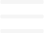
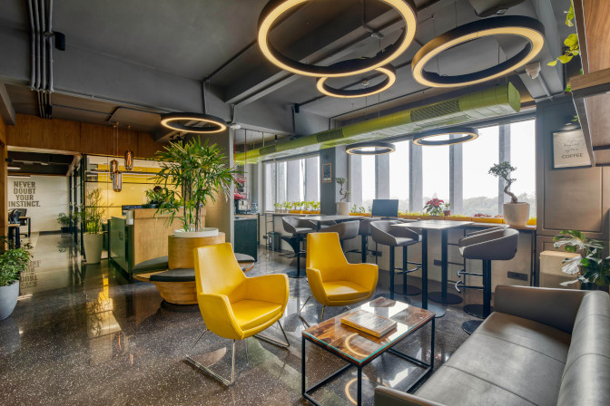

# WeBarelyWork — Essential CSS Coworking Space Site


A coworking space listing page — the **Build a Coworking Space Site** project from **Scrimba's Fullstack Web Development Path (Essential CSS module)**.

This README is written as a **complete concept revision guide**. Reading it top to bottom will revise every CSS technique introduced in this project, with a focus on the new concepts not covered in the NFT Site or Portfolio: `position: relative/absolute/fixed`, Flexbox alignment tricks (`margin-left: auto`, `align-self`, `gap`), `z-index`, `list-style-type`, the `<button>` element, and the fixed floating chatbox pattern.

---

# Table of Contents

1. [Project Overview](#1-project-overview)
2. [Project Structure](#2-project-structure)
3. [How This Project Differs From Previous Ones](#3-how-this-project-differs-from-previous-ones)
4. [Lesson Breakdown — What Each Step Builds](#4-lesson-breakdown--what-each-step-builds)
5. [Building the Foundations](#5-building-the-foundations)
   - [Reset: `margin: 0` and `padding: 0`](#51-reset-margin-0-and-padding-0)
   - [`font-family` with Montserrat](#52-font-family-with-montserrat)
   - [Global `color` on `body`](#53-global-color-on-body)
6. [The Navigation Bar — Flexbox in Depth](#6-the-navigation-bar--flexbox-in-depth)
   - [`display: flex` on `<ul>`](#61-display-flex-on-ul)
   - [`list-style-type: none`](#62-list-style-type-none)
   - [`align-items: center`](#63-align-items-center)
   - [`gap`](#64-gap)
   - [`margin-left: auto` — The Push Trick](#65-margin-left-auto--the-push-trick)
7. [Positioning the Menu Icon](#7-positioning-the-menu-icon)
   - [Icon Sizing with `width`](#71-icon-sizing-with-width)
   - [`cursor: pointer`](#72-cursor-pointer)
8. [The Hero Heading](#8-the-hero-heading)
   - [`font-weight: 400` on `h1`](#81-font-weight-400-on-h1)
   - [Margin with Two Values](#82-margin-with-two-values)
9. [The Image Banner — `position: relative` and `position: absolute`](#9-the-image-banner--position-relative-and-position-absolute)
   - [`position: relative` on `.item`](#91-position-relative-on-item)
   - [`position: absolute` on `.img-banner`](#92-position-absolute-on-img-banner)
   - [`display: block` on `.item-img`](#93-display-block-on-item-img)
10. [The Caption Row — Advanced Flexbox](#10-the-caption-row--advanced-flexbox)
    - [`justify-content: space-between`](#101-justify-content-space-between)
    - [`gap` Between Flex Items](#102-gap-between-flex-items)
    - [`align-self: center` on `<button>`](#103-align-self-center-on-button)
11. [The `<button>` Element](#11-the-button-element)
    - [`border: none`](#111-border-none)
    - [`cursor: pointer` on buttons](#112-cursor-pointer-on-buttons)
12. [The Fixed Chatbox — `position: fixed`](#12-the-fixed-chatbox--position-fixed)
    - [`position: fixed` explained](#121-position-fixed-explained)
    - [Centering an Image Inside a Fixed Circle](#122-centering-an-image-inside-a-fixed-circle)
    - [`border-radius: 50%`](#123-border-radius-50)
13. [`z-index` — Controlling Stack Order](#13-z-index--controlling-stack-order)
    - [What is the stacking context?](#131-what-is-the-stacking-context)
    - [When `z-index` is needed](#132-when-z-index-is-needed)
14. [All Four `position` Values — Side-by-Side](#14-all-four-position-values--side-by-side)
15. [New CSS Properties Summary](#15-new-css-properties-summary)
16. [HTML Structure Recap](#16-html-structure-recap)
17. [How to Run](#17-how-to-run)
18. [Course Reference](#18-course-reference)

---

# 1. Project Overview

WeBarelyWork is a fictional coworking space listing site. The page includes:

* A **sticky navigation bar** (dark background) with:
  * A text logo ("WeBarelyWork") on the left
  * A location pin icon in the middle
  * A hamburger menu icon pushed to the far right using `margin-left: auto`
* A **hero heading** introducing the site
* **Three listing cards**, each containing:
  * A full-width photo (`display: block; width: 100%`)
  * An optional **"Exclusive" badge** pinned to the top-left of the image using `position: absolute`
  * A **caption row** with a description paragraph and a "Book" button, laid out using Flexbox
* A **fixed floating chatbox button** pinned to the bottom-right corner of the viewport using `position: fixed`

The project's key focus is **CSS positioning** — understanding `static`, `relative`, `absolute`, and `fixed` and knowing exactly when to use each one.

---

# 2. Project Structure

```
04. Essential CSS/
│
└── 04. Coworking Space Site/
    ├── index.html      → HTML structure: nav, three item sections, chatbox
    ├── index.css       → All styling: reset, flexbox nav, positioning, button, chatbox
    └── images/
        ├── burger.png      → Hamburger menu icon (nav, right side)
        ├── pin.png         → Location pin icon (nav, centre)
        ├── hygge.jpg       → Listing photo #1 (has the "Exclusive" banner)
        ├── sky-garden.jpg  → Listing photo #2
        ├── generator.jpg   → Listing photo #3
        └── message.png     → Chat icon inside the floating chatbox button
```

---

# 3. How This Project Differs From Previous Ones

| Feature | NFT Site | Portfolio | Coworking Site |
|---------|----------|-----------|----------------|
| Font | Roboto | Roboto | **Montserrat** (new) |
| Font weights imported | 400, 500, 700 | 300, 900 | **400, 700** |
| CSS reset | `margin: 0` on `body` | `margin: 0` on `body` | **`margin: 0` AND `padding: 0`** on `body` |
| Navigation bar | None | None | **Full `<nav>` with `<ul>` flex layout** |
| `list-style-type: none` | Not used | Not used | **Introduced here** |
| `align-items` (flexbox) | Not used | Not used | **Introduced here** |
| `gap` (flexbox) | Not used | Not used | **Introduced here** |
| `margin-left: auto` push trick | Not used | Not used | **Introduced here** |
| `position: relative` | Used (Accessible Dev) | Not used | **Re-introduced, central concept** |
| `position: absolute` | Used (Accessible Dev) | Not used | **Re-introduced, central concept** |
| `position: fixed` | Not used anywhere | Not used | **Introduced here** |
| `<button>` element | Not used | Not used | **Introduced here** |
| `border: none` | Not used | Not used | **Introduced here** |
| `align-self` (flexbox) | Not used | Not used | **Introduced here** |
| `z-index` | Used (skip link) | Not used | **Covered in depth here** |
| `cursor: pointer` | Not used | Not used | **Introduced here** |
| `display: block` on images | Not used | Not used | **Introduced here** |
| Fixed floating UI element | Not used | Not used | **Chatbox — introduced here** |

---

# 4. Lesson Breakdown — What Each Step Builds

The coworking site is built across a series of focused lessons on Scrimba:

| Lesson | Topic | What it Does |
|--------|-------|-------------|
| Build the foundations | Reset, font, body colour | `margin: 0`, `padding: 0`, `font-family`, `color` on `body` |
| Margin: auto on flex children | Push trick | `margin-left: auto` on `.align-right` to push the burger icon to the right |
| Position the menu icon | Icon sizing, `cursor` | `width: 25px`, `cursor: pointer` on `li` |
| Position: relative & absolute | Banner overlay | `.item { position: relative }` + `.img-banner { position: absolute }` |
| Add the image banner | Absolute positioning in use | "Exclusive" badge pinned to top-left of image |
| Add buttons | `<button>` element | `border: none`, `cursor: pointer`, `background-color`, `align-self: center` |
| Stop the vertical stretch on the button | `align-self` | Prevents button from stretching full height of the flex row |
| Position Fixed | Chatbox button | `.chatbox-bg { position: fixed; bottom: 6px; right: 6px }` |
| Add the chatbox | Icon centred inside circle | `display: flex; margin: auto` to centre chatbox icon |
| `z-index` | Stack order | Understanding when and why `z-index` is needed |

---

# 5. Building the Foundations

## 5.1 Reset: `margin: 0` and `padding: 0`

```css
body {
    margin: 0;
    padding: 0;
}
```

Previous projects only reset `margin: 0`. This project adds `padding: 0` as well — a more thorough reset.

**Why both?**

Different browsers apply different default margins **and** paddings to elements. The `<ul>` element is a good example: browsers typically apply both a default `margin` and `padding` to it, which would push the nav content inward. Resetting `padding: 0` on `body` starts from a completely clean slate.

> In professional projects you would typically use a reset stylesheet (like Normalize.css from the Accessible Development module) rather than just targeting `body`. But for a focused project, this targeted reset is sufficient.

---

## 5.2 `font-family` with Montserrat

```html
<link rel="preconnect" href="https://fonts.googleapis.com">
<link rel="preconnect" href="https://fonts.gstatic.com" crossorigin>
<link href="https://fonts.googleapis.com/css2?family=Montserrat:wght@400;700&display=swap" rel="stylesheet">
```

```css
body {
    font-family: 'Montserrat', sans-serif;
}
```

Montserrat is a geometric sans-serif with a clean, modern feel — well-suited to a product listing page. Two weights are imported: `400` (regular) and `700` (bold).

| Weight | Where it's used |
|--------|----------------|
| `400` | Body text, `h1` heading (intentionally light) |
| `700` | `.logo`, `button` text |

---

## 5.3 Global `color` on `body`

```css
body {
    color: #282828;
}
```

`#282828` is a very dark grey — near-black but softer than pure `#000000`. Setting it on `body` means all text inherits this colour by default. The header and button then **override** this with `whitesmoke` where white text is needed on a dark background.

---

# 6. The Navigation Bar — Flexbox in Depth

The navigation bar is the most complex component in this project. It introduces several new Flexbox properties not seen in the previous projects.

```css
ul {
    display: flex;
    list-style-type: none;
    align-items: center;
    margin: 0;
    padding: 25px;
    gap: 10px;
}
```

```html
<nav>
    <ul>
        <li class="logo">WeBarelyWork</li>
        <li></li>
        <li class="align-right"></li>
    </ul>
</nav>
```

## 6.1 `display: flex` on `<ul>`

Applying `display: flex` to the `<ul>` turns the list items into **flex items**, arranging them in a horizontal row. Without it, `<li>` elements are block-level and stack vertically.

---

## 6.2 `list-style-type: none`

```css
ul {
    list-style-type: none;
}
```

By default, `<ul>` displays a bullet point (•) before each `<li>`. `list-style-type: none` removes those bullets entirely. This is standard practice whenever you use a `<ul>` for navigation or any non-bullet-point layout purpose.

| `list-style-type` value | Appearance |
|------------------------|------------|
| `disc` | • Filled circle (default for `<ul>`) |
| `circle` | ○ Hollow circle |
| `square` | ■ Filled square |
| `decimal` | 1. 2. 3. (default for `<ol>`) |
| `none` | No marker — used for nav lists |

> **Accessibility note:** Removing `list-style-type` with CSS does not remove the list semantics — screen readers still announce it as a list. If you want to visually suppress bullets while keeping list semantics, `list-style-type: none` is exactly right.

---

## 6.3 `align-items: center`

```css
ul {
    align-items: center;
}
```

`align-items` controls how flex items are aligned along the **cross axis** (perpendicular to the main axis).

In a horizontal flex row (default), the cross axis is **vertical**:

```
Main axis →   [WeBarelyWork]  [📍]  [☰]
                                         ↑ Cross axis (vertical)
```

Without `align-items: center`:
- Flex items stretch to fill the full height of the flex container (default `align-items: stretch`)
- The text logo and icon images would be at different vertical positions depending on their height

With `align-items: center`:
- All items are vertically centred within the row — the text logo, pin icon, and burger icon all sit on the same horizontal midline

| `align-items` value | Effect on cross axis |
|--------------------|---------------------|
| `stretch` | Items fill the full height of the container (default) |
| `center` | Items centred vertically |
| `flex-start` | Items aligned to the top |
| `flex-end` | Items aligned to the bottom |

---

## 6.4 `gap`

```css
ul {
    gap: 10px;
}
```

`gap` sets the space **between** flex items. It is a shorthand for `row-gap` and `column-gap`.

Compare to previous approaches:
- NFT Site: used `margin` on individual elements
- Portfolio: used `margin-bottom` on elements

`gap` is cleaner — you set it once on the flex container and all direct children automatically get spacing between them (but NOT at the start or end, unlike `margin`).

```
[WeBarelyWork] 10px [📍] 10px [☰]
              ↑gap       ↑gap
```

> `gap` also works with CSS Grid. It is the modern replacement for using `margin` on flex children to create spacing.

---

## 6.5 `margin-left: auto` — The Push Trick

```css
.align-right {
    margin-left: auto;
}
```

```html
<li class="align-right">
    
</li>
```

This is one of the most useful Flexbox patterns. Here's how it works:

1. Normally, flex items are packed together with `gap` between them
2. When you set `margin-left: auto` on a flex item, the browser gives that margin **all the remaining available space** in the container
3. This effectively pushes that item — and everything after it — to the right

```
Before .align-right:
[WeBarelyWork] [📍] [☰]    ← all packed to the left

After .align-right on [☰]:
[WeBarelyWork] [📍]                              [☰]
                      ↑ margin-left: auto fills here
```

This technique is used constantly in professional navbars to push action buttons, avatars, or icons to the right without using `position: absolute` or `float`.

---

# 7. Positioning the Menu Icon

## 7.1 Icon Sizing with `width`

```css
.icon {
    width: 25px;
}
```

All icons in the navbar (pin and burger) share the `.icon` class and are set to `25px` wide. The height scales proportionally — no `height` is needed because images maintain their aspect ratio by default when only one dimension is set.

---

## 7.2 `cursor: pointer`

```css
li {
    cursor: pointer;
}
```

`cursor: pointer` changes the mouse cursor to the hand/pointer cursor when hovering over an element — the same cursor that appears over links by default. This signals interactivity to the user.

| `cursor` value | Mouse appearance | Use case |
|---------------|-----------------|----------|
| `default` | Arrow cursor | Normal non-interactive elements |
| `pointer` | Hand/finger cursor | Clickable elements: buttons, links, icons |
| `text` | I-beam cursor | Text input areas |
| `not-allowed` | Circle with slash | Disabled elements |
| `grab` | Open hand | Draggable elements |

> Native `<a>` and `<button>` elements already show `cursor: pointer` automatically. You only need to set it manually on elements like `<li>`, `<div>`, or `` that you are making interactable.

---

# 8. The Hero Heading

```css
h1 {
    font-size: 40px;
    font-weight: 400;
    margin: 30px 25px;
}
```

```html
<section>
    <h1>The best coworking spaces for lazy devs.</h1>
</section>
```

## 8.1 `font-weight: 400` on `h1`

Browsers render `<h1>` as `font-weight: bold` (700) by default. Setting `font-weight: 400` explicitly overrides this to the regular weight. This gives the heading a lighter, less aggressive feel — a design choice that pairs well with the bold logo and button text, creating weight contrast across the page.

---

## 8.2 Margin with Two Values

```css
h1 {
    margin: 30px 25px;
}
```

```
margin: 30px  25px
        ↑      ↑
   top/bottom  left/right
```

The `25px` left/right margin creates a **gutter** between the heading and the edge of the viewport — matching the `padding: 25px` used on the `<ul>` so everything aligns vertically.

> This is a common design pattern: ensure the leftmost content edge of the heading aligns with the leftmost content edge of the navbar. Both use `25px` to achieve this.

---

# 9. The Image Banner — `position: relative` and `position: absolute`

This is the core positioning concept of the project. The "Exclusive" badge overlays the top-left corner of the listing image.

```html
<section class="item">
    
    <div class="img-banner">
        Exclusive
    </div>
    <div class="caption">...</div>
</section>
```

```css
.item {
    position: relative;
}

.item-img {
    display: block;
    width: 100%;
}

.img-banner {
    position: absolute;
    top: 0;
    left: 0;
    background-color: #cd6858;
    color: whitesmoke;
    padding: 10px;
}
```

## 9.1 `position: relative` on `.item`

```css
.item {
    position: relative;
}
```

`position: relative` does two things:
1. The element **stays in the normal document flow** — it doesn't move visually
2. It becomes a **positioning context** (also called a "containing block") for any `position: absolute` children

Without `position: relative` on `.item`, the `.img-banner` would position itself relative to the nearest positioned ancestor — which could be `<body>` or the viewport, causing it to appear in the wrong place.

---

## 9.2 `position: absolute` on `.img-banner`

```css
.img-banner {
    position: absolute;
    top: 0;
    left: 0;
}
```

`position: absolute` **removes the element from the normal document flow** entirely. It is then positioned relative to its nearest `position: relative` ancestor — in this case, `.item`.

```
┌──────────────────────────────────┐
│ .item (position: relative)       │
│ ┌──────────┐                     │
│ │ Exclusive│ ← .img-banner       │
│ │(absolute)│   top:0, left:0     │
│ └──────────┘                     │
│ [===== hygge.jpg photo ==========│
│ ================================]│
└──────────────────────────────────┘
```

`top: 0; left: 0` pins it to the top-left corner of `.item`. Other elements (the image, the caption) do not shift to make room for `.img-banner` — it floats above them.

### The `relative` + `absolute` Pair — The Rule

> **Rule:** To position a child absolutely within a specific parent, the parent must have `position: relative` (or `absolute` or `fixed` — any non-static value). The child gets `position: absolute`.

This is the same pattern used for the skip link in the Accessible Development module — but here it is used for a decorative overlay badge.

---

## 9.3 `display: block` on `.item-img`

```css
.item-img {
    display: block;
    width: 100%;
}
```

By default, `` is an **inline** element. Inline elements sit on the text baseline, which means a small invisible gap appears below them (the space reserved for descenders like 'g', 'p', 'y'). This gap would show as a thin sliver of background between the image and the caption.

Setting `display: block` removes the inline baseline gap:

```
Without display: block:
┌──────────────────┐
│  hygge.jpg image │
└──────────────────┘
  ← tiny gap here (baseline space)
┌──────────────────┐
│ caption          │

With display: block:
┌──────────────────┐
│  hygge.jpg image │
└──────────────────┘
┌──────────────────┐
│ caption          │
```

> This is a common CSS gotcha with images. Whenever you have an image inside a container and see an unexpected gap below it, `display: block` on the image is the fix.

---

# 10. The Caption Row — Advanced Flexbox

```css
.caption {
    display: flex;
    justify-content: space-between;
    gap: 20px;
    margin: 0 25px;
}
```

```html
<div class="caption">
    <p>Skiving in Scandinavia? Relax with a latte at Hygge Lounge.</p>
    <button>Book</button>
</div>
```

## 10.1 `justify-content: space-between`

Seen in the NFT Site (for side-by-side images), now applied here to the caption row. The paragraph takes up as much space as it needs on the left; the button sits at the far right.

---

## 10.2 `gap` Between Flex Items

```css
.caption {
    gap: 20px;
}
```

The `gap: 20px` ensures a minimum `20px` of space between the paragraph text and the button — preventing them from touching even on narrow screens. Combined with `space-between`, the gap acts as a minimum guaranteed spacing.

---

## 10.3 `align-self: center` on `<button>`

```css
button {
    align-self: center;
}
```

This is a new property not seen in previous projects. `align-self` overrides the flex container's `align-items` setting **for a single flex item**.

Without `align-self: center`:
- The default `align-items` on the `.caption` flex container is `stretch` (since it wasn't set)
- The button would **stretch to the full height** of the flex row — as tall as the paragraph

With `align-self: center`:
- The button ignores the container's stretch behaviour
- It centres itself vertically within the row, keeping its natural height

```
Without align-self: center:
┌────────────────────────────────────────────┐
│ Skiving in Scandinavia? Relax...           │
│ Relax with a latte at Hygge Lounge.        │ [  Book  ]  ← stretched full height
└────────────────────────────────────────────┘

With align-self: center:
┌────────────────────────────────────────────┐
│ Skiving in Scandinavia? Relax...           │
│ Relax with a latte at Hygge Lounge.  [Book]│ ← natural height, vertically centred
└────────────────────────────────────────────┘
```

| Property | Set on | Controls |
|----------|--------|---------|
| `align-items` | Flex **container** | Default alignment for all flex children |
| `align-self` | Individual flex **item** | Overrides `align-items` for that one item |

---

# 11. The `<button>` Element

```css
button {
    align-self: center;
    border: none;
    background-color: #cd6858;
    color: whitesmoke;
    padding: 10px 15px;
    font-weight: 700;
    cursor: pointer;
}
```

```html
<button>Book</button>
```

This project introduces the native `<button>` HTML element for the first time. Previous projects used `<a>` tags styled as buttons.

## 11.1 `border: none`

```css
button {
    border: none;
}
```

Browsers apply a default border and background to `<button>` elements (which varies by OS and browser). `border: none` removes the default border entirely so your custom `background-color` is the only visual treatment.

> You will also commonly see `outline: none` used together with `border: none` on buttons. However, `outline: none` removes the focus ring — which harms keyboard accessibility. Only suppress outlines if you provide an alternative `:focus` style.

### `<button>` vs `<a>` — When to Use Which

| Element | Correct use case |
|---------|-----------------|
| `<a href="...">` | **Navigation** — takes the user somewhere (a URL, a section) |
| `<button>` | **Action** — does something (submit form, trigger JS, open modal) |

In this project, "Book" performs an action (booking a coworking space), so `<button>` is semantically correct.

---

## 11.2 `cursor: pointer` on Buttons

```css
button {
    cursor: pointer;
}
```

Unlike `<a>`, native `<button>` elements do **not** automatically show the pointer cursor in all browsers — they show the default arrow cursor. Setting `cursor: pointer` makes it clear the button is clickable.

---

# 12. The Fixed Chatbox — `position: fixed`

```css
.chatbox-bg {
    background: orange;
    width: 40px;
    height: 40px;
    display: flex;
    border-radius: 50%;
    position: fixed;
    bottom: 6px;
    right: 6px;
    cursor: pointer;
}

.chatbox-img {
    width: 20px;
    margin: auto;
}
```

```html
<div class="chatbox-bg">
    
</div>
```

## 12.1 `position: fixed` Explained

`position: fixed` removes the element from the normal document flow and positions it **relative to the browser viewport** — not relative to any parent element. It **stays in the same place as the user scrolls**.

```
Viewport (what the user sees)
┌─────────────────────────────┐
│  Header                     │
│  Listing 1                  │
│  Listing 2                  │
│  Listing 3                  │
│                         [💬]│ ← .chatbox-bg: always stays here
└─────────────────────────────┘
                              ↑
           bottom: 6px, right: 6px
```

`bottom: 6px; right: 6px` pins it `6px` from the bottom and `6px` from the right of the viewport — regardless of how far the user has scrolled.

### All Four `position` Values Compared

| Value | In document flow? | Positioned relative to | Moves when scrolling? |
|-------|------------------|-----------------------|----------------------|
| `static` | ✅ Yes | N/A — not positioned | N/A |
| `relative` | ✅ Yes | Itself (offset from normal position) | ✅ Yes |
| `absolute` | ❌ No | Nearest positioned ancestor (or `<body>`) | ✅ Yes (scrolls with page) |
| `fixed` | ❌ No | The **viewport** | ❌ No — stays put |

---

## 12.2 Centering an Image Inside a Fixed Circle

```css
.chatbox-bg {
    display: flex;      /* Makes it a flex container */
    width: 40px;
    height: 40px;
}

.chatbox-img {
    width: 20px;
    margin: auto;       /* auto on all sides → centres in flex container */
}
```

`margin: auto` on a flex item distributes any available space equally on **all four sides** — effectively centering the item both horizontally and vertically within the flex container. This is a neat trick that works because:

1. `.chatbox-bg` is a fixed 40×40px flex container
2. `.chatbox-img` is 20px wide (and proportionally tall)
3. Remaining space: 20px horizontally, some pixels vertically
4. `margin: auto` splits that remaining space equally → centred in both directions

> This is a one-element centering pattern: `display: flex` on the parent + `margin: auto` on the child. No need for `justify-content` or `align-items` when you control the child's margin.

---

## 12.3 `border-radius: 50%`

```css
.chatbox-bg {
    border-radius: 50%;
}
```

`border-radius: 50%` makes the element a **perfect circle** when `width` and `height` are equal. Since `.chatbox-bg` is `40px × 40px`, `border-radius: 50%` rounds it into a circle.

```
width: 40px, height: 40px:
┌────────┐  →  border-radius: 50%  →  (●)
│        │
└────────┘
```

This is the canonical technique for circular avatars, icon buttons, and FABs (Floating Action Buttons) in modern UI.

---

# 13. `z-index` — Controlling Stack Order

## 13.1 What is the Stacking Context?

When elements overlap (for example, `.img-banner` overlays `.item-img`), the browser has to decide which one appears **on top**. By default, elements that come **later in the HTML** are painted on top of elements that come earlier.

`z-index` lets you manually control this stacking order:

```css
.img-banner {
    z-index: 1;    /* Painted above elements with lower z-index */
}
```

```
z-index: 2  ←  appears on top
z-index: 1  ←  appears in middle
z-index: 0  ←  appears at the bottom (default)
z-index: -1 ←  appears behind normal flow elements
```

---

## 13.2 When `z-index` is Needed

`z-index` **only works on positioned elements** — elements with `position` set to `relative`, `absolute`, `fixed`, or `sticky`. It has no effect on `position: static` elements.

In this project:

| Element | `position` | `z-index` situation |
|---------|------------|---------------------|
| `.img-banner` | `absolute` | Naturally overlays image because it's later in the HTML |
| `.chatbox-bg` | `fixed` | Naturally appears above all page content because `fixed` elements are in their own stacking layer |

Because `.img-banner` comes after `.item-img` in the HTML, it naturally paints on top without needing an explicit `z-index`. If you add more elements that should go above it, you would then use `z-index` values to control the order.

### The `z-index` Challenge

The course includes a `z-index` challenge to test this understanding. A common example:

```css
/* Without z-index */
.chatbox-bg {
    position: fixed;
    /* Naturally above everything because it's fixed-positioned */
}

/* If something else were higher, you'd use: */
.chatbox-bg {
    position: fixed;
    z-index: 100;   /* Ensure it's always on top */
}
```

---

# 14. All Four `position` Values — Side-by-Side

This project is the first one to meaningfully use three of the four position values in the same codebase. Here is a complete summary:

```css
/* position: static (default — not written) */
/* Every element starts here. Top/left/right/bottom have no effect. */
h1 { /* static by default */ }

/* position: relative */
/* Stays in flow. Becomes positioning context for absolute children. */
.item {
    position: relative;
}

/* position: absolute */
/* Removed from flow. Positioned inside the nearest relative ancestor. */
.img-banner {
    position: absolute;
    top: 0;
    left: 0;
}

/* position: fixed */
/* Removed from flow. Pinned to the viewport. Doesn't scroll. */
.chatbox-bg {
    position: fixed;
    bottom: 6px;
    right: 6px;
}
```

### Visual Mental Model

```
Normal document flow (static):
[Header] → [h1] → [Section 1] → [Section 2] → [Section 3]
                                     ↑
              .item (relative) — stays here in flow,
              but creates a coordinate system for children

              .img-banner (absolute) — floats OUT of flow,
              pins itself to top-left of .item's coordinate system

[Viewport edge]
              .chatbox-bg (fixed) — floats OUT of flow,
              pins itself to the viewport — ignores all ancestors
```

---

# 15. New CSS Properties Summary

All CSS properties introduced in this project that were **not in the NFT Site or Portfolio**:

| Property | Where Used | Purpose |
|----------|------------|---------|
| `padding: 0` on `body` | `body` | Removes browser default padding (in addition to `margin: 0`) |
| `list-style-type: none` | `ul` | Removes bullet points from list items |
| `align-items: center` | `ul` | Vertically centres flex items along the cross axis |
| `gap` | `ul`, `.caption` | Spacing between flex items |
| `margin-left: auto` | `.align-right` | Pushes the flex item to the far right of the container |
| `cursor: pointer` | `li`, `button`, `.chatbox-bg` | Shows the hand cursor — signals interactivity |
| `display: block` | `.item-img` | Removes the baseline gap below inline images |
| `position: relative` | `.item` | Establishes positioning context for absolute children |
| `position: absolute` | `.img-banner` | Pins element inside its `relative` parent, out of flow |
| `position: fixed` | `.chatbox-bg` | Pins element to the viewport — stays while scrolling |
| `align-self: center` | `button` | Overrides flex container's `align-items` for one item |
| `border: none` | `button` | Removes browser default button border |
| `border-radius: 50%` | `.chatbox-bg` | Turns an equal-width-height element into a circle |
| `z-index` | (discussed) | Controls paint order of overlapping positioned elements |

---

# 16. HTML Structure Recap

```
<!doctype html>
<html>
├── <head>
│   ├── <link rel="preconnect" href="fonts.googleapis.com">
│   ├── <link rel="preconnect" href="fonts.gstatic.com" crossorigin>
│   ├── <link href="...Montserrat:wght@400;700...">   → Google Fonts
│   └── <link rel="stylesheet" href="index.css">
│
└── <body>
    │
    ├── <header>                                        ← Dark background
    │   └── <nav>
    │       └── <ul>                                   ← Flex container
    │           ├── <li class="logo">WeBarelyWork</li> ← Brand text (left)
    │           ├── <li>                               ← Pin icon (middle)
    │           │   └── 
    │           └── <li class="align-right">           ← Burger icon (pushed right)
    │               └── 
    │
    ├── <main>
    │   │
    │   ├── <section>
    │   │   └── <h1>The best coworking spaces for lazy devs.</h1>
    │   │
    │   ├── <section class="item">                      ← position: relative
    │   │   ├──   ← display: block; width:100%
    │   │   ├── <div class="img-banner">Exclusive</div> ← position: absolute
    │   │   └── <div class="caption">                   ← display: flex
    │   │       ├── <p>Skiving in Scandinavia...</p>
    │   │       └── <button>Book</button>               ← align-self: center
    │   │
    │   ├── <section class="item">                      ← No banner (no .img-banner)
    │   │   ├── 
    │   │   └── <div class="caption">
    │   │       ├── <p>Bored in Barcelona...</p>
    │   │       └── <button>Book</button>
    │   │
    │   └── <section class="item">
    │       ├── 
    │       └── <div class="caption">
    │           ├── <p>Relaxing in Rio...</p>
    │           └── <button>Book</button>
    │
    └── <div class="chatbox-bg">                        ← position: fixed
        └──  ← margin: auto (centred)
```

### Semantic Elements Used

| Element | ARIA Role | Purpose in This Page |
|---------|-----------|----------------------|
| `<header>` | `banner` | Top navigation area |
| `<nav>` | `navigation` | Navigation landmark |
| `<ul>` | `list` | Navigation list (flex row) |
| `<main>` | `main` | Primary page content |
| `<section>` | `region` | Each listing card |
| `<button>` | `button` | Booking action |

---

# 17. How to Run

1. Clone the repository
   ```bash
   git clone https://github.com/Nilanchal0107/Web-Development-MiniProjects.git
   ```

2. Navigate to the project folder
   ```bash
   cd "04. Essential CSS/04. Coworking Space Site"
   ```

3. Open `index.html` in your browser or use **Live Server** in VS Code.

4. **Things to explore in DevTools:**
   - Select `.item` → toggle `position: relative` off → the `.img-banner` will jump to a different position
   - Select `.img-banner` → change `top: 0; left: 0` to `bottom: 0; right: 0` — the badge moves to the bottom-right corner
   - Select `.chatbox-bg` → toggle `position: fixed` to `position: static` — watch it jump into the document flow and disappear from the corner
   - Select `button` → toggle `align-self: center` off — watch the button stretch to full row height
   - Select `.align-right` → toggle `margin-left: auto` off — the burger icon snaps back next to the pin icon
   - Scroll the page while watching the chatbox — it stays fixed regardless of scroll position

---

# 18. Course Reference

* **Platform:** [Scrimba Fullstack Path](https://scrimba.com/fullstack-path-c0fullstack)
* **Section:** Essential CSS Module → Build a Coworking Space Site
* **Topics Covered:** CSS reset (`margin: 0; padding: 0`) · `font-family` (Montserrat) · `list-style-type: none` · `display: flex` · `align-items` · `gap` · `margin-left: auto` (push trick) · `cursor: pointer` · `display: block` on images · `position: relative` · `position: absolute` · `position: fixed` · `align-self: center` · `<button>` element · `border: none` · `border-radius: 50%` · `z-index` · `margin: auto` for centering in flex
* **Reference Docs:**
  - [MDN — CSS position](https://developer.mozilla.org/en-US/docs/Web/CSS/position)
  - [MDN — z-index](https://developer.mozilla.org/en-US/docs/Web/CSS/z-index)
  - [MDN — align-self](https://developer.mozilla.org/en-US/docs/Web/CSS/align-self)
  - [MDN — `<button>`](https://developer.mozilla.org/en-US/docs/Web/HTML/Element/button)
  - [CSS Tricks — A Complete Guide to Flexbox](https://css-tricks.com/snippets/css/a-guide-to-flexbox/)

---

# Author

**Nilanchal Jena**
GitHub: [https://github.com/Nilanchal0107](https://github.com/Nilanchal0107)

> *Positioning is the single concept that unlocks the most complex layouts in CSS. Once you understand that `absolute` is always relative to the nearest positioned ancestor — and `fixed` is always relative to the viewport — every overlay, badge, modal, dropdown, and floating button becomes a predictable, repeatable pattern.*
