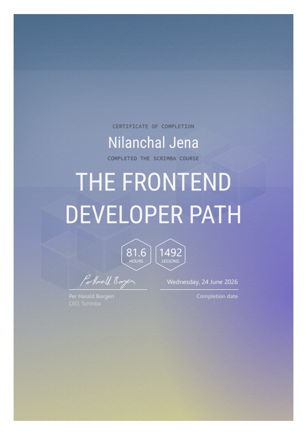
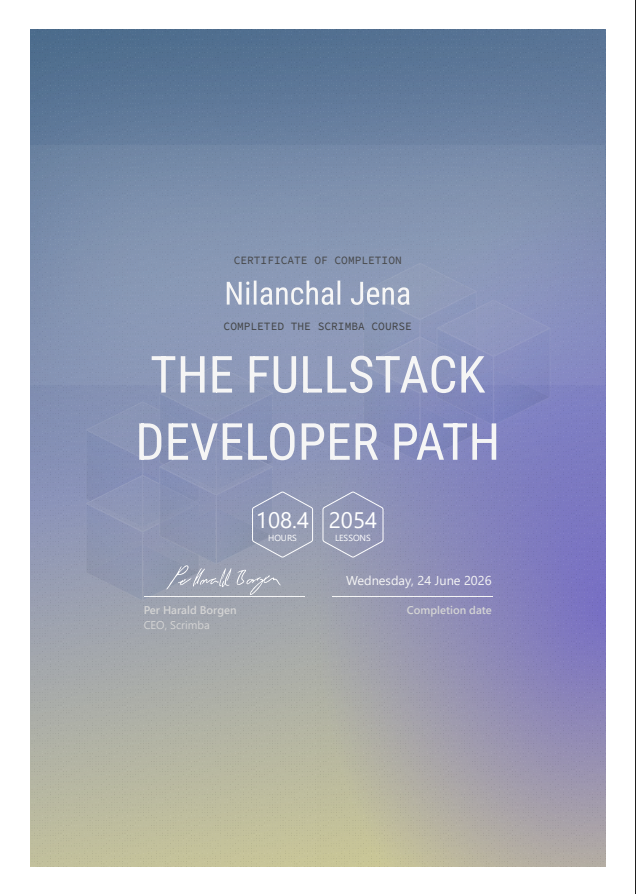

# Scrimba — Frontend & Fullstack Web Development Paths


This repository contains my solutions, projects, and notes from **Scrimba's Frontend Developer Path** and **Fullstack Developer Path** — comprehensive, project-driven courses covering the entire JavaScript ecosystem: frontend, backend, databases, AI engineering, TypeScript, and modern frameworks.

---

# Table of Contents

1. [Course Information](#1-course-information)
2. [Certificates](#2-certificates)
3. [Progress Tracker](#3-progress-tracker)
4. [Course Sections](#4-course-sections)
5. [Repository Structure](#5-repository-structure)
6. [Key Projects](#6-key-projects)
7. [Technologies Used](#7-technologies-used)
8. [Capstone Project](#8-capstone-project)
9. [Course Links](#9-course-links)
10. [Author](#10-author)
11. [Disclaimer](#11-disclaimer)

---

# 1. Course Information

| Field | Details |
|-------|---------|
| **Courses** | Frontend Developer Path + Fullstack Developer Path |
| **Platform** | Scrimba |
| **Host** | Per Borgen (Scrimba CEO) |
| **Languages** | HTML, CSS, JavaScript, TypeScript, SQL |
| **Frameworks** | React 18/19, Node.js, Express.js, Next.js 15 |
| **Topics** | DOM, APIs, Async JS, AI Engineering, Databases, Testing, Rendering Strategies, Full-Stack |
| **Certificates** | 2 Earned — Frontend Developer + Fullstack Developer |
| **Repo Status** | All 17 modules documented with individual READMEs |

---

# 2. Certificates

> 🏆 Both certificates are earned and verified through Scrimba.

### Frontend Developer Path



---

### Fullstack Developer Path



---

# 3. Progress Tracker

- [x] **01. HTML and CSS Fundamentals**
- [x] **02. JavaScript Fundamentals**
- [x] **03. Accessible Development**
- [x] **04. Essential CSS**
- [x] **05. Essential JavaScript**
- [x] **06. Responsive Design**
- [x] **07. APIs and Async JavaScript**
- [x] **08. AI Engineering**
- [x] **09. Node.js**
- [x] **10. Databases**
- [x] **11. Express.js**
- [x] **12. User Interface Design**
- [x] **13. React.js Fundamentals**
- [x] **14. Testing**
- [x] **15. Advanced React.js**
- [x] **16. TypeScript**
- [x] **17. Next.js**

---

# 4. Course Sections

| # | Section | Key Topics | Status |
|---|---------|-----------|--------|
| 01 | HTML and CSS Fundamentals | Semantic HTML, Box model, Flexbox, Grid | ✅ |
| 02 | JavaScript Fundamentals | Variables, Functions, DOM, Events | ✅ |
| 03 | Accessible Development | ARIA, Screen readers, Semantic elements | ✅ |
| 04 | Essential CSS | Responsive layouts, CSS Variables, Animations | ✅ |
| 05 | Essential JavaScript | Array methods, Closures, Prototypes | ✅ |
| 06 | Responsive Design | Mobile-first, Media queries, Fluid layouts | ✅ |
| 07 | APIs and Async JavaScript | Fetch, Promises, `async`/`await`, REST APIs | ✅ |
| 08 | AI Engineering | OpenAI API, Prompt engineering, AI integration | ✅ |
| 09 | Node.js | CommonJS, File system, npm, CLI scripts | ✅ |
| 10 | Databases | SQL, SQLite, CRUD, Schema design | ✅ |
| 11 | Express.js | REST APIs, Routing, Middleware, MVC pattern | ✅ |
| 12 | User Interface Design | Design principles, Figma, Components | ✅ |
| 13 | React.js Fundamentals | JSX, Props, State, Hooks, React Router | ✅ |
| 14 | Testing | Vitest, Unit tests, Integration tests | ✅ |
| 15 | Advanced React.js | Custom hooks, Context, Performance | ✅ |
| 16 | TypeScript | Types, Generics, Utility types, TS in React, TS in Express | ✅ |
| 17 | Next.js | App Router, SSG/SSR/ISR, SQLite, Search, Pagination | ✅ |

---

# 5. Repository Structure

```
Web-Development-MiniProjects/
│
├── 01. HTML and CSS Fundamentals/
│   ├── 01. Business Card/
│   ├── 02. Space Exploration Site/
│   ├── 03. Birthday Gift Website/
│   └── 04. Solo Project - Hometown Exploration Site/
│
├── 02. JavaScript Fundamentals/
│   ├── 01. Counter App/
│   ├── 02. JavaScript Challenges Part-1/
│   ├── 03. Solo Project - Basketball Scoreboard/
│   ├── 04. Blackjack Game/
│   ├── 05. Javascript Challenges Part-2/
│   ├── 06. Solo Project - Password Generator/
│   ├── 07. Chrome Extension/
│   ├── 08. Javascript Challenges Part-3/
│   └── 09. Solo Project - Unit Converter/
│
├── 03. Accessible Development/
│   └── Synet Eats/
│
├── 04. Essential CSS/
│   ├── 01. NFT Site/
│   ├── 02. Portfolio/
│   ├── 03. Solo Project - Instagram Clone/
│   └── 04. Coworking Space Site/
│
├── 05. Essential JavaScript/
│   ├── 01. Cookie Consent/
│   ├── 02. Meme App/
│   ├── 03. X Clone/
│   ├── 04. Mini Projects/
│   └── 05. Solo Project - Restaurant Ordering App/
│
├── 06. Responsive Design/
│   ├── 01. Responsive Layouts/
│   ├── 02. Build a Product Page/
│   ├── 03. CSS Grid/
│   └── 04. Solo Project - Learning Journal/
│
├── 07. APIs and Async JavaScript/
│   ├── 01. Intro to APIs/
│   ├── 02. URLs and REST/
│   ├── 03. Solo Project - Color Scheme Generator/
│   ├── 04. Async JavaScript/
│   ├── 05. Solo Project - Movie Watchlist/
│   └── 06. Capstone Project/
│
├── 08. AI Engineering/
│   ├── 01. AI Engineering Fundamentals/
│   ├── 02. Solo Project - Translation App/
│   ├── 03. RAG and Vector Databases/
│   ├── 04. Solo Project - Movie AI App/
│   └── 05. AI Agents/
│
├── 09. Node.js/
│   ├── 01. Build a Node API/
│   ├── 02. Build a Fullstack Node App/
│   └── 03. Solo Project - GoldDigger/
│
├── 10. Databases/
│   ├── 01. Intro to Databases/
│   ├── 02. Writing SQL Queries/
│   └── 03. Creating and Joining Tables/
│
├── 11. Express.js/
│   ├── 01. Build an Express API/
│   ├── 02. Build a FullStack Express App/
│   └── 03. Authentication/
│
├── 13. React.js Fundamentals/
│   ├── 01. Static Pages/
│   ├── 02. Solo Project - Business Card/
│   ├── 03. Data-Driven React/
│   ├── 04. React State/
│   ├── 05. Side Effects/
│   ├── 06. Capstone Project #1 - Tenzies/
│   ├── 07. Capstone Project #2 - Assembly EndGame/
│   └── 08. Solo Project - Quiz App/
│
├── 15. Advanced React.js/
│   ├── 01. Reusability/
│   ├── 02. Performance/
│   ├── 03. Solo Project - Component Library++/
│   ├── 04. Routing/
│   ├── 05. Persistense/
│   └── 06. Authentication/
│
├── 16. TypeScript/
│   ├── 01. TypeScript Fundamentals/
│   ├── 02. TypeScript in React/
│   ├── 03. Solo project - Typed Tenzies/
│   └── 04. TypeScript & Express/
│
├── 17. Next.js/
│   ├── 01. Build a Next.js App/
│   ├── 02. Rendering Strategies and More/
│   └── 03. Making Data Flow/
│
├── README.md                     ← this file
├── certificate-frontend.png      ← Scrimba Frontend Developer Path certificate
└── certificate-fullstack.png     ← Scrimba Fullstack Developer Path certificate
```

> **⚠️ Disclaimer:** Solo projects (marked as *Solo project* in the Key Projects table) will be built and documented in the future.

Each module folder contains:
- **Project source files** — HTML, CSS, JS, TS, TSX as appropriate
- **A detailed `README.md`** with project notes and solutions
- **Challenge solutions** and **notes** where applicable

---

# 6. Key Projects

| Project | Module | Tech Stack | Description |
|---------|--------|-----------|-------------|
| **Hometown Homepage** | 01. HTML & CSS | HTML, CSS | Solo project — responsive personal hometown site |
| **Counter App** | 02. JavaScript | HTML, CSS, JS | DOM manipulation with event listeners |
| **Blackjack Game** | 02. JavaScript | HTML, CSS, JS | Card game with game state logic |
| **Password Generator** | 05. Essential JS | HTML, CSS, JS | Generates secure passwords with options |
| **Chrome Extension** | 05. Essential JS | HTML, CSS, JS | Browser extension using the Chrome APIs |
| **Stock Prediction App** | 07. APIs & Async | JS, Fetch, REST | Fetches and displays live stock data |
| **AI Engineering App** | 08. AI Engineering | JS, OpenAI API | AI-powered app using prompt engineering |
| **Node.js CLI Tool** | 09. Node.js | Node.js | Command-line utility built with Node |
| **Express REST API** | 11. Express.js | Node.js, Express | Full REST API with routing and middleware |
| **React Tenzies / Quizzical** | 13. React.js | React, Hooks | Dice game and quiz app with state management |
| **Assembly: Endgame** | 16. TypeScript | React, TypeScript | Typed word-guessing game — TS in React |
| **Pet Shelter API** | 16. TypeScript | Node.js, Express, TS | Typed REST API — TS in Express |
| **PrintForge** | 17. Next.js | Next.js 15, SQLite, TS | 3D model marketplace — full Next.js app |

---

# 7. Technologies Used

### Languages


### Frameworks & Libraries


### Tools & Platforms


---

# 8. Capstone Project

The capstone project brings together all skills learned throughout the course — frontend (React/Next.js), backend (Node.js/Express), databases (SQLite/SQL), TypeScript, and deployment.

Details will be added once the project is completed.

---

# 9. Course Links

* 🖥️ [Scrimba Frontend Developer Path](https://scrimba.com/frontend-path-c0j)
* 🖥️ [Scrimba Fullstack Developer Path](https://scrimba.com/fullstack-path-c0fullstack)
* 💾 [Official Scrimba GitHub](https://github.com/scrimba/learn-fullstack-development)

---

# 10. Author

**Nilanchal Jena**
GitHub: [@Nilanchal0107](https://github.com/Nilanchal0107)

---

# 11. Disclaimer

All course content and curriculum belong to **Scrimba**.
This repository contains my personal project solutions and notes, created for learning purposes only.
